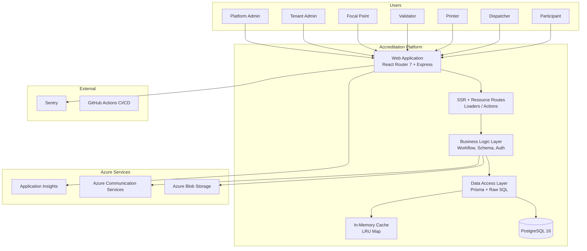
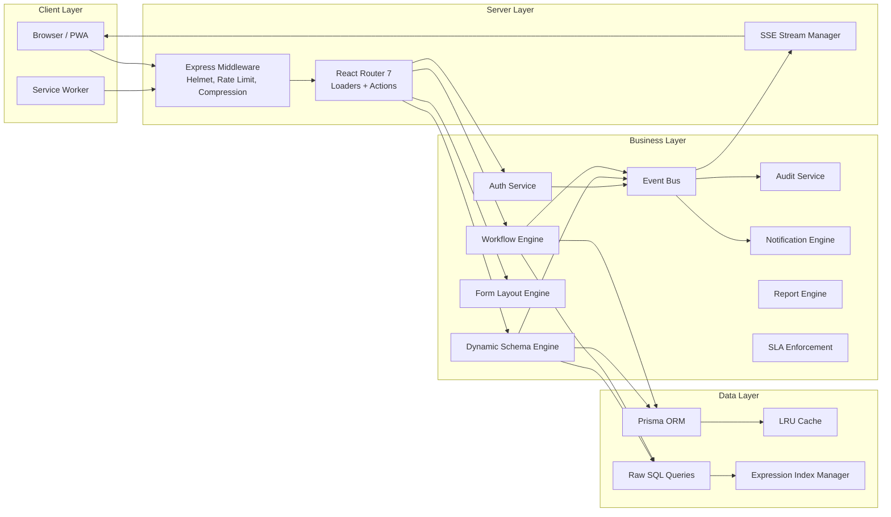
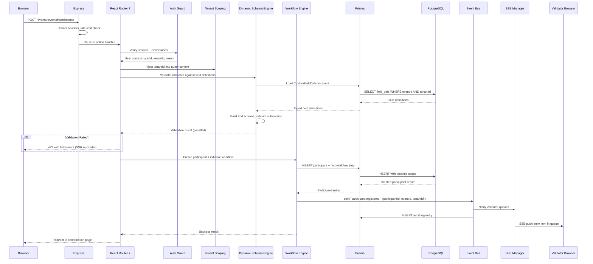
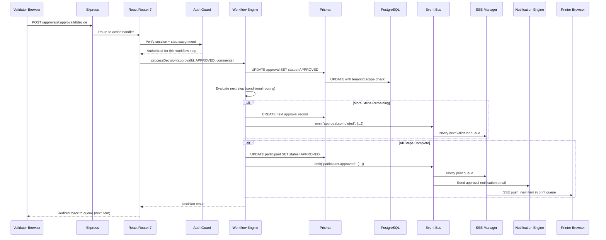
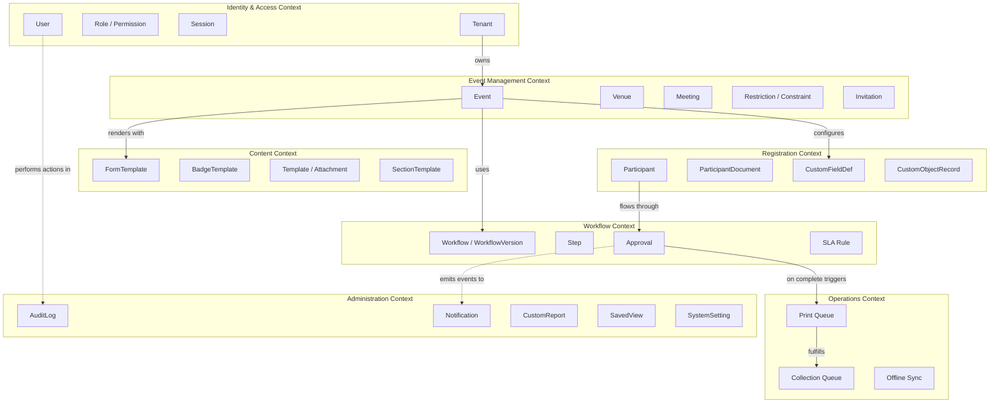
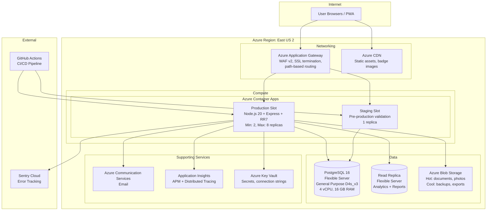
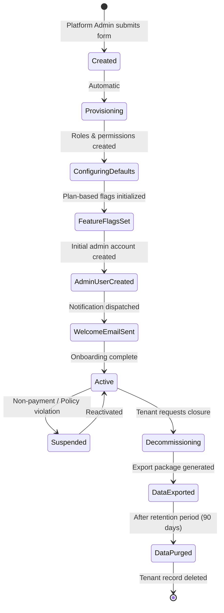

# Module 00: Architecture Overview

> **Module:** 00 - Architecture Overview
> **Version:** 1.0
> **Last Updated:** February 10, 2026
> **Status:** Draft
> **Requires:** None (foundation module)
> **Required By:** All modules
> **Integrates With:** [Module 01: Data Model Foundation](./01-DATA-MODEL-FOUNDATION.md), [Module 05: Security & Access Control](./05-SECURITY-AND-ACCESS-CONTROL.md), [Module 06: Infrastructure & DevOps](./06-INFRASTRUCTURE-AND-DEVOPS.md)

---

## Table of Contents

1. [Overview](#1-overview)
   - 1.1 [Product Vision](#11-product-vision)
   - 1.2 [Design Principles](#12-design-principles)
   - 1.3 [Key Stakeholders](#13-key-stakeholders-and-their-needs)
   - 1.4 [Scope of This Module](#14-scope-of-this-module)
   - 1.5 [Key Personas](#15-key-personas)
2. [Architecture](#2-architecture)
   - 2.1 [Technology Stack](#21-technology-stack)
   - 2.2 [Architecture Diagram](#22-architecture-diagram)
   - 2.3 [Request Flow](#23-request-flow)
   - 2.4 [Multi-Tenancy Model](#24-multi-tenancy-model)
   - 2.5 [DDD Bounded Contexts](#25-ddd-bounded-contexts)
   - 2.6 [Event-Driven Architecture](#26-event-driven-architecture)
   - 2.7 [Deployment Topology](#27-deployment-topology)
   - 2.8 [Architecture Decision Records](#28-architecture-decision-records)
3. [Data Model](#3-data-model)
   - 3.1 [Tenant Model](#31-tenant-model)
   - 3.2 [Cross-Cutting Concerns](#32-cross-cutting-concerns)
   - 3.3 [Database Strategy](#33-database-strategy)
4. [API Specification](#4-api-specification)
   - 4.1 [Health Check Endpoint](#41-health-check-endpoint)
   - 4.2 [Tenant Management API](#42-tenant-management-api)
   - 4.3 [System Information API](#43-system-information-api)
5. [Business Logic](#5-business-logic)
   - 5.1 [Tenant Onboarding Lifecycle](#51-tenant-onboarding-lifecycle)
   - 5.2 [Multi-Tenancy Enforcement](#52-multi-tenancy-enforcement)
   - 5.3 [Feature Flag System](#53-feature-flag-system)
6. [User Interface](#6-user-interface)
   - 6.1 [Platform Admin Dashboard](#61-platform-admin-dashboard)
   - 6.2 [Tenant Switcher](#62-tenant-switcher)
   - 6.3 [System Health View](#63-system-health-view)
7. [Integration Points](#7-integration-points)
   - 7.1 [Module Integration Map](#71-module-integration-map)
   - 7.2 [Shared Services](#72-shared-services)
   - 7.3 [External Service Contracts](#73-external-service-contracts)
8. [Configuration](#8-configuration)
   - 8.1 [Environment Variables](#81-environment-variables)
   - 8.2 [Runtime Configuration](#82-runtime-configuration)
   - 8.3 [Feature Flags Schema](#83-feature-flags-schema)
9. [Testing Strategy](#9-testing-strategy)
   - 9.1 [Architecture Testing](#91-architecture-testing)
   - 9.2 [Multi-Tenancy Testing](#92-multi-tenancy-testing)
   - 9.3 [Performance Baseline Tests](#93-performance-baseline-tests)
10. [Security Considerations](#10-security-considerations)
    - 10.1 [Tenant Isolation Guarantees](#101-tenant-isolation-guarantees)
    - 10.2 [Attack Surface Analysis](#102-attack-surface-analysis)
    - 10.3 [Security Architecture Principles](#103-security-architecture-principles)
11. [Performance Requirements](#11-performance-requirements)
    - 11.1 [SLA Targets](#111-sla-targets)
    - 11.2 [Scalability Analysis](#112-scalability-analysis)
    - 11.3 [Caching Strategy Overview](#113-caching-strategy-overview)
12. [Open Questions & Decisions](#12-open-questions--decisions)

- [Appendix](#appendix)
  - A. [Glossary](#a-glossary)
  - B. [References](#b-references)
  - C. [Architecture Decision Records](#c-architecture-decision-records-full-format)

---

## 1. Overview

### 1.1 Product Vision

A **multi-tenant accreditation platform** that enables any organization to manage event registration, document verification, multi-step approval workflows, and badge generation -- without developer intervention for per-event customization.

The platform transforms from a single-purpose tool into a **configurable engine** where tenant administrators define their own data models, form layouts, approval pipelines, and badge designs through visual interfaces.

**Extended Vision Statement:** The platform targets organizations that manage high-security, high-volume accreditation processes -- international summits, government conferences, multi-day conventions, and recurring institutional events. Each tenant operates in complete isolation while sharing infrastructure costs. The architecture prioritizes configurability at every layer: schema (dynamic fields via JSONB), presentation (visual form designer), process (node-based workflow builder), and output (badge template editor).

**Target Scale (Year 1):**

| Metric                          | Target     |
| ------------------------------- | ---------- |
| Concurrent Tenants              | 20-50      |
| Events per Tenant per Year      | 5-20       |
| Participants per Event          | 500-10,000 |
| Peak Concurrent Users           | 500        |
| Badge Prints per Day (peak)     | 5,000      |
| Document Uploads per Day (peak) | 2,000      |

### 1.2 Design Principles

| Principle                    | Description                                                                                                                                 |
| ---------------------------- | ------------------------------------------------------------------------------------------------------------------------------------------- |
| **Configuration over Code**  | Admins customize events through UI-based field definitions, form designers, and workflow builders -- no migrations or deployments           |
| **Tenant Isolation**         | Every data record, file, and configuration is scoped to a tenant with no cross-tenant data leakage                                          |
| **Type Safety at the Core**  | Universal fields (identity, status, workflow position) remain as typed Prisma columns; only event-specific fields use dynamic JSONB         |
| **Progressive Disclosure**   | Simple events work out of the box; advanced features (conditional forms, parallel workflows, custom objects) are available but not required |
| **Offline-First Operations** | Badge printing, collection, and scanning work without continuous connectivity                                                               |
| **Audit Everything**         | Every state change, approval, login, and configuration change is logged with user, timestamp, IP, and metadata                              |

**Additional Architectural Principles:**

| Principle                   | Description                                                                                                                  |
| --------------------------- | ---------------------------------------------------------------------------------------------------------------------------- |
| **Fail Closed**             | When security checks cannot be performed (cache miss, service unavailable), the system denies access rather than allowing it |
| **Idempotent Operations**   | All write operations use idempotency keys to tolerate network retries without duplication                                    |
| **Schema Evolution Safety** | JSONB dynamic fields use versioned schemas; old data is readable under new schemas via coercion defaults                     |
| **Observable by Default**   | Every request carries a correlation ID; structured logs, metrics, and traces are emitted at every layer boundary             |
| **Graceful Degradation**    | Non-critical features (notifications, analytics, real-time updates) can fail without blocking core workflows                 |

### 1.3 Key Stakeholders and Their Needs

| Stakeholder        | Primary Need                                                                              |
| ------------------ | ----------------------------------------------------------------------------------------- |
| **Tenant Admin**   | Configure events, define fields, design forms, set up workflows -- all without developers |
| **Focal Point**    | Self-service portal to register delegation members within assigned quotas                 |
| **Validator**      | Fast, mobile-friendly queue to review and approve/reject registrations                    |
| **Printer**        | Print queue with batch operations and offline support                                     |
| **Dispatcher**     | Badge collection tracking with QR scanning                                                |
| **Participant**    | Clean, adaptive registration form that shows only relevant fields                         |
| **Platform Admin** | System health, tenant management, and cross-tenant operations                             |

### 1.4 Scope of This Module

Module 00 establishes the architectural foundation upon which all other modules build. It is responsible for:

- **Defining the system boundaries** -- what is inside the platform versus delegated to external services
- **Establishing architectural patterns** -- multi-tenancy strategy, request lifecycle, bounded contexts, event-driven communication
- **Pinning the technology stack** -- specific versions, rationale for each choice, migration paths
- **Specifying cross-cutting concerns** -- logging, caching, configuration, health checks
- **Providing the tenant data model** -- the Tenant entity is the root aggregate upon which all other data depends
- **Setting performance and reliability targets** -- SLAs that all modules must satisfy

This module does NOT cover:

- Detailed data models beyond the Tenant entity (see [Module 01](./01-DATA-MODEL-FOUNDATION.md))
- Authentication and authorization flows (see [Module 05](./05-SECURITY-AND-ACCESS-CONTROL.md))
- CI/CD pipeline configuration (see [Module 06](./06-INFRASTRUCTURE-AND-DEVOPS.md))
- Individual feature specifications (see Modules 02-04, 07-12)

### 1.5 Key Personas

#### Persona 1: Platform Administrator (Super Admin)

| Attribute             | Detail                                                                                                                   |
| --------------------- | ------------------------------------------------------------------------------------------------------------------------ |
| **Role**              | Platform Admin                                                                                                           |
| **Scope**             | GLOBAL -- cross-tenant visibility                                                                                        |
| **Goals**             | Monitor system health, onboard/offboard tenants, manage subscription plans, investigate cross-tenant issues              |
| **Pain Points**       | Needs a single dashboard for all tenants; must never accidentally modify tenant data; requires fast access to audit logs |
| **Key Workflows**     | Tenant creation wizard, subscription management, system health monitoring, global audit log search                       |
| **Technical Profile** | Technically proficient, comfortable with admin interfaces, may need CLI access for advanced operations                   |
| **Access Frequency**  | Daily for monitoring, weekly for tenant management                                                                       |

#### Persona 2: Tenant Administrator

| Attribute             | Detail                                                                                                                     |
| --------------------- | -------------------------------------------------------------------------------------------------------------------------- |
| **Role**              | Tenant Admin                                                                                                               |
| **Scope**             | TENANT -- single-tenant full control                                                                                       |
| **Goals**             | Set up events end-to-end, configure dynamic fields, design forms, build approval workflows, manage users, generate reports |
| **Pain Points**       | Must accomplish complex configuration without developer support; needs to clone and reuse configurations across events     |
| **Key Workflows**     | Event creation, field definition, form design, workflow building, user/role management, badge template design              |
| **Technical Profile** | Non-technical to moderately technical; relies entirely on visual interfaces                                                |
| **Access Frequency**  | Intensive during event setup (weeks before), periodic during event execution                                               |

#### Persona 3: Focal Point (Delegation Manager)

| Attribute             | Detail                                                                                                                  |
| --------------------- | ----------------------------------------------------------------------------------------------------------------------- |
| **Role**              | Focal Point                                                                                                             |
| **Scope**             | EVENT -- specific event with delegation quota                                                                           |
| **Goals**             | Register delegation members efficiently, track registration status, manage quota allocation, ensure document compliance |
| **Pain Points**       | Quota management across large delegations; needs bulk operations; requires clear status visibility                      |
| **Key Workflows**     | Participant registration, document upload, status tracking, quota monitoring, bulk CSV import                           |
| **Technical Profile** | Varies widely; interface must be intuitive for non-technical users                                                      |
| **Access Frequency**  | Concentrated bursts during registration windows                                                                         |

#### Persona 4: Validator (Approver)

| Attribute             | Detail                                                                                                          |
| --------------------- | --------------------------------------------------------------------------------------------------------------- |
| **Role**              | Validator                                                                                                       |
| **Scope**             | EVENT -- specific workflow step(s)                                                                              |
| **Goals**             | Process approval queue rapidly, review documents and photos, make approve/reject/return decisions with comments |
| **Pain Points**       | Queue must be responsive on mobile; needs batch operations for high volume; must not miss SLA deadlines         |
| **Key Workflows**     | Queue management, document review, approval/rejection with comments, SLA monitoring                             |
| **Technical Profile** | Uses mobile devices frequently; needs fast, touch-friendly interface                                            |
| **Access Frequency**  | Continuous during event processing windows; real-time queue updates via SSE                                     |

#### Persona 5: Operations Staff (Printer/Dispatcher)

| Attribute             | Detail                                                                                                                     |
| --------------------- | -------------------------------------------------------------------------------------------------------------------------- |
| **Role**              | Printer or Dispatcher                                                                                                      |
| **Scope**             | EVENT -- badge production and distribution                                                                                 |
| **Goals**             | Print badges in bulk, track collection status, work reliably offline at event venues                                       |
| **Pain Points**       | Network connectivity is unreliable at event venues; must handle printer failures gracefully; QR scanning must work offline |
| **Key Workflows**     | Batch badge printing, QR scanning for collection, offline data sync, reprint management                                    |
| **Technical Profile** | Operational staff; needs minimal-friction interface; offline capability is non-negotiable                                  |
| **Access Frequency**  | Intensive during event days; offline periods of hours                                                                      |

---

## 2. Architecture

### 2.1 Technology Stack

| Layer              | Technology                          | Version Pin                       | Rationale                                                                                                        | Alternatives Considered                                                         |
| ------------------ | ----------------------------------- | --------------------------------- | ---------------------------------------------------------------------------------------------------------------- | ------------------------------------------------------------------------------- |
| **Runtime**        | Node.js                             | >= 20 LTS                         | Native ESM, stable `fetch`, performance improvements in V8, LTS support through April 2026                       | Deno (ecosystem maturity), Bun (production stability)                           |
| **Framework**      | React Router 7 + Vite               | RR 7.x, Vite 6.x                  | Server-first rendering, nested routing with loaders/actions, progressive enhancement, single deployment artifact | Next.js (vendor lock-in concerns, Vercel optimization), Remix (merged into RR7) |
| **Server**         | Express 4                           | 4.21+                             | Mature middleware ecosystem (Helmet, rate limiting, compression), well-understood concurrency model              | Fastify (faster but smaller ecosystem), Hono (newer, less battle-tested)        |
| **Database**       | PostgreSQL 16 + Prisma 5            | PG 16.x, Prisma 5.x               | JSONB for dynamic fields, GIN indexes, full-text search, row-level security capability, Prisma type safety       | MongoDB (schema flexibility but weaker ACID), MySQL (weaker JSON support)       |
| **UI Components**  | React 18, shadcn/ui, Tailwind CSS 4 | React 18.x, shadcn latest, TW 4.x | Copy-paste Radix primitives with OKLCH design tokens, WCAG 2.1 AA, Conform-compatible native wrappers            | Raw Radix UI (more wiring), Chakra UI (heavier runtime)                         |
| **Forms**          | Conform + Zod                       | Latest stable                     | Server-validated forms with progressive enhancement, works without JS                                            | React Hook Form (client-only validation), Formik (legacy patterns)              |
| **File Storage**   | Azure Blob Storage                  | Latest SDK                        | Document, photo, and backup persistence; tiered storage for cost optimization                                    | AWS S3 (multi-cloud complexity), local filesystem (not scalable)                |
| **Email**          | Azure Communication Services        | Latest SDK                        | Transactional and broadcast email; integrates with Azure ecosystem                                               | SendGrid (additional vendor), AWS SES (multi-cloud)                             |
| **Real-Time**      | Server-Sent Events (SSE)            | Native                            | Live queue updates for validators, printers, dispatchers; simpler than WebSockets for server-to-client           | WebSockets (unnecessary bidirectional complexity), polling (latency)            |
| **PDF Generation** | @react-pdf/renderer                 | Latest stable                     | Badge and report generation with React component model                                                           | Puppeteer (heavier, browser dependency), PDFKit (lower-level API)               |
| **Visual Editors** | @dnd-kit, @xyflow/react             | Latest stable                     | Drag-and-drop form design, node-based workflow building                                                          | react-beautiful-dnd (deprecated), react-flow (renamed to xyflow)                |
| **Testing**        | Vitest + MSW + Playwright           | Latest stable                     | Unit, integration, and E2E testing with Vite-native runner; MSW for API mocking                                  | Jest (slower with ESM), Cypress (heavier E2E)                                   |
| **Monitoring**     | Sentry + Pino + Azure App Insights  | Latest stable                     | Error tracking, structured logging (JSON), APM with distributed tracing                                          | Datadog (cost), ELK stack (operational overhead)                                |

**Version Pinning Strategy:**

- **Major versions** are pinned in `package.json` using the caret (`^`) operator for minor/patch flexibility
- **Lock files** (`package-lock.json`) are committed to ensure deterministic builds
- **Renovate bot** runs weekly PRs for dependency updates with automated test gates
- **Node.js LTS** is pinned in `.nvmrc` and `Dockerfile` to ensure consistent runtime across dev, CI, and production
- **PostgreSQL version** is pinned in infrastructure-as-code (Bicep templates) to prevent unintended upgrades

### 2.2 Architecture Diagram

**System Layer Diagram (Original):**

```
+------------------------------------------------------------------+
|  CLIENT (Browser / PWA)                                          |
|  +-- React 18 + shadcn/ui + Tailwind CSS 4                      |
|  +-- Conform forms (progressive enhancement)                     |
|  +-- SSE connection (live queue updates)                         |
|  +-- Service Worker (offline badge collection/printing)          |
|  +-- @dnd-kit / @xyflow/react (visual editors)                  |
+------------------------------------------------------------------+
|  EXPRESS SERVER                                                   |
|  +-- Helmet (CSP with nonces, HSTS, permissions-policy)          |
|  +-- Rate Limiting (3-tier: general 100, mutations 50, auth 10)  |
|  +-- Compression + Structured Logging (Pino)                     |
|  +-- Suspicious Request Blocking                                  |
+------------------------------------------------------------------+
|  REACT ROUTER 7 SSR LAYER                                        |
|  +-- Loaders: data fetching + auth guards + tenant scoping       |
|  +-- Actions: form submissions + workflow execution               |
|  +-- SSE Streams: validator/printer/dispatcher queue updates     |
|  +-- Resource Routes: file downloads, API endpoints               |
+------------------------------------------------------------------+
|  BUSINESS LOGIC LAYER                                            |
|  +-- Workflow Engine (state machine + conditional routing)        |
|  +-- Dynamic Schema Engine (field defs -> Zod -> Conform)        |
|  +-- Form Layout Engine (JSON definition -> rendered form)        |
|  +-- Authentication (session + 2FA + progressive lockout)        |
|  +-- Authorization (RBAC + tenant scope + event access)          |
|  +-- Audit System (every state change logged)                    |
|  +-- Notification Engine (in-app + email + configurable prefs)   |
|  +-- Report Engine (predefined + custom + JSONB aggregations)    |
|  +-- SLA Enforcement (background job for overdue step detection) |
+------------------------------------------------------------------+
|  DATA ACCESS LAYER                                               |
|  +-- Prisma ORM (typed queries for fixed columns)                |
|  +-- Raw SQL (JSONB queries for custom fields)                   |
|  +-- Expression Indexes (auto-created for searchable fields)     |
|  +-- In-Memory Cache (countries, roles, titles, field defs)      |
+------------------------------------------------------------------+
|  EXTERNAL SERVICES                                               |
|  +-- Azure Blob Storage (documents, photos, backups)             |
|  +-- Azure Communication Services (email)                        |
|  +-- Sentry (error tracking)                                     |
|  +-- Azure Application Insights (APM)                            |
+------------------------------------------------------------------+
|  INFRASTRUCTURE                                                  |
|  +-- Docker (multi-stage build: deps -> build -> production)     |
|  +-- PostgreSQL 16 (primary database)                            |
|  +-- GitHub Actions CI/CD (lint -> test -> build -> deploy)      |
|  +-- Health Check (/up endpoint)                                 |
+------------------------------------------------------------------+
```

**Expanded C4 Context Diagram (Mermaid):**



**Component Interaction Diagram (Mermaid):**



### 2.3 Request Flow

**Basic Request Flow (Original):**

```
Browser -> Express (Helmet, Rate Limit, Compression)
        -> React Router Handler
        -> Loader/Action (auth guard -> tenant scoping)
        -> Business Logic (workflow, schema, validation)
        -> Prisma / Raw SQL
        -> PostgreSQL
        -> Response (SSR HTML or JSON)
```

**Detailed Sequence: Participant Registration Submission**



**Detailed Sequence: Approval Decision**



### 2.4 Multi-Tenancy Model

**Core Principle:** Every data record includes a `tenantId` foreign key. Queries are scoped by tenant at the data access layer. Unique constraints are composite with `tenantId` to prevent cross-tenant conflicts.

```
Tenant A: Event 1, Event 2 -> isolated data
Tenant B: Event 3, Event 4 -> isolated data
Platform Admin: cross-tenant visibility (GLOBAL scope)
```

**Isolation Strategy: Shared Database, Shared Schema**

The platform uses a **single-database, shared-schema** multi-tenancy model. This choice optimizes for operational simplicity and cost efficiency at the target scale (20-50 tenants). Every table that holds tenant-specific data includes a `tenantId` column with a foreign key constraint to the `Tenant` table.

```
+----------------------------------------------------------------+
|                     PostgreSQL 16 Instance                      |
|                                                                |
|  +------------------+  +------------------+  +----------------+ |
|  | Tenant A Data    |  | Tenant B Data    |  | Tenant C Data  | |
|  | tenantId = "abc" |  | tenantId = "def" |  | tenantId = "ghi"| |
|  | Events: 1, 2     |  | Events: 3, 4     |  | Events: 5      | |
|  | Users: 50        |  | Users: 120       |  | Users: 30      | |
|  +------------------+  +------------------+  +----------------+ |
|                                                                |
|  +----------------------------------------------------------+  |
|  | Shared Reference Data (countries, titles, etc.)           |  |
|  | Platform Admin Data (tenantId = NULL, scope = GLOBAL)     |  |
|  +----------------------------------------------------------+  |
+----------------------------------------------------------------+
```

**Tenant Data Routing Middleware:**

Every request passes through tenant resolution middleware that extracts the tenant context from the authenticated session and injects it into the request context. This is enforced at the framework level, not left to individual route handlers.

```typescript
// Tenant resolution middleware (conceptual)
async function resolveTenant(req: Request): Promise<TenantContext> {
  const session = await getSession(req);
  const user = session?.userId ? await userService.findById(session.userId) : null;

  if (!user) throw new UnauthorizedError();

  // Platform admins can switch tenant context
  if (user.scope === "GLOBAL") {
    const targetTenantId = req.headers["x-tenant-id"] || user.activeTenantId;
    return { tenantId: targetTenantId, scope: "GLOBAL", userId: user.id };
  }

  // Regular users are locked to their tenant
  if (!user.tenantId) throw new ForbiddenError("No tenant assigned");
  return { tenantId: user.tenantId, scope: "TENANT", userId: user.id };
}
```

**Tenant Scoping in Queries:**

All Prisma queries and raw SQL statements are automatically scoped by `tenantId`. This scoping is enforced through a repository pattern that wraps Prisma operations.

```typescript
// Scoped query pattern (conceptual)
class TenantScopedRepository<T> {
  constructor(
    private prisma: PrismaClient,
    private model: string,
    private tenantId: string,
  ) {}

  async findMany(where: Partial<T> = {}) {
    return this.prisma[this.model].findMany({
      where: { ...where, tenantId: this.tenantId },
    });
  }

  async create(data: Omit<T, "tenantId">) {
    return this.prisma[this.model].create({
      data: { ...data, tenantId: this.tenantId },
    });
  }

  // All operations inject tenantId automatically
}
```

**Composite Unique Constraints:**

Uniqueness that should be per-tenant (such as event slugs, role names, or custom object names) uses composite unique constraints:

```prisma
@@unique([tenantId, name])    // Role names unique per tenant
@@unique([tenantId, slug])    // Event slugs unique per tenant
@@unique([tenantId, code])    // Participant type codes per tenant
```

**Cross-Tenant Operations (Platform Admin Only):**

Platform administrators with `GLOBAL` scope can query across tenants for:

- System health dashboards (aggregate metrics per tenant)
- Audit log searches (investigating security incidents)
- Tenant management (CRUD on tenant records)
- Usage reporting (subscription enforcement)

These operations bypass tenant scoping but are guarded by GLOBAL scope checks and produce audit log entries.

### 2.5 DDD Bounded Contexts

The platform is decomposed into seven bounded contexts, each representing a cohesive domain with its own ubiquitous language, aggregates, and module boundary. Inter-context communication uses domain events via the internal event bus.



**Context Map -- Relationships:**

| Upstream Context  | Downstream Context | Relationship Type  | Integration Mechanism                                         |
| ----------------- | ------------------ | ------------------ | ------------------------------------------------------------- |
| Identity & Access | All Contexts       | Shared Kernel      | User/Tenant entities referenced directly                      |
| Event Management  | Registration       | Customer-Supplier  | Registration depends on event configuration                   |
| Event Management  | Workflow           | Customer-Supplier  | Workflow is configured per event                              |
| Event Management  | Content            | Customer-Supplier  | Templates are bound to events                                 |
| Registration      | Workflow           | Published Language | Participant state changes trigger workflow transitions        |
| Workflow          | Operations         | Published Language | Approval completion publishes to print queue via domain event |
| All Contexts      | Administration     | Conformist         | All contexts emit audit entries; Admin context consumes       |

**Module-to-Context Mapping:**

| Bounded Context   | Primary Module                                | Supporting Modules                                    |
| ----------------- | --------------------------------------------- | ----------------------------------------------------- |
| Identity & Access | Module 05 (Security)                          | Module 00 (Tenant), Module 01 (Data Model)            |
| Event Management  | Module 07 (Events)                            | Module 01 (Data Model)                                |
| Registration      | Module 08 (Registration)                      | Module 02 (Dynamic Schema), Module 03 (Form Designer) |
| Workflow          | Module 04 (Workflow Engine)                   | Module 02 (Dynamic Schema)                            |
| Content           | Module 03 (Form Designer), Module 09 (Badges) | Module 02 (Dynamic Schema)                            |
| Operations        | Module 10 (Operations)                        | Module 09 (Badges)                                    |
| Administration    | Module 11 (Admin & Reporting)                 | Module 00 (Architecture)                              |

### 2.6 Event-Driven Architecture

#### Event Bus Design

The platform uses an internal event bus starting with Node.js `EventEmitter` for in-process domain event publishing. This is a deliberate starting choice: it provides zero-latency, zero-infrastructure event routing suitable for the single-process deployment model. The architecture is designed for future extraction to an external message broker (Azure Service Bus) if horizontal scaling requires it.

```typescript
// Domain event bus (conceptual)
import { EventEmitter } from "node:events";

interface DomainEvent {
  eventType: string;
  version: number;
  timestamp: string; // ISO 8601
  correlationId: string; // Request trace ID
  tenantId: string;
  payload: Record<string, unknown>;
  metadata: {
    userId: string;
    source: string; // Bounded context that emitted
    idempotencyKey: string;
  };
}

class DomainEventBus extends EventEmitter {
  private handlers = new Map<string, Array<(event: DomainEvent) => Promise<void>>>();

  async publish(event: DomainEvent): Promise<void> {
    // 1. Persist to event log (outbox pattern)
    await this.persistToOutbox(event);
    // 2. Emit to in-process subscribers
    this.emit(event.eventType, event);
  }

  subscribe(eventType: string, handler: (event: DomainEvent) => Promise<void>): void {
    this.on(eventType, async (event: DomainEvent) => {
      try {
        await handler(event);
      } catch (error) {
        // Log failure but do not crash -- dead letter for retry
        logger.error({ eventType, error }, "Event handler failed");
        await this.persistToDeadLetter(event, error);
      }
    });
  }

  private async persistToOutbox(event: DomainEvent): Promise<void> {
    // Store event in database for durability and replay
  }

  private async persistToDeadLetter(event: DomainEvent, error: unknown): Promise<void> {
    // Store failed event for manual investigation
  }
}

export const eventBus = new DomainEventBus();
```

#### Domain Events Catalog

| Event Type               | Version | Source Context    | Payload Fields                                  | Consumers                                                                 |
| ------------------------ | ------- | ----------------- | ----------------------------------------------- | ------------------------------------------------------------------------- |
| `tenant.created`         | 1       | Identity & Access | `tenantId, name, plan`                          | Administration (audit)                                                    |
| `tenant.deactivated`     | 1       | Identity & Access | `tenantId, reason`                              | All contexts (cascade deactivation)                                       |
| `user.registered`        | 1       | Identity & Access | `userId, tenantId, email`                       | Administration (audit, welcome notification)                              |
| `user.locked`            | 1       | Identity & Access | `userId, reason, lockCount`                     | Administration (audit, alert)                                             |
| `event.created`          | 1       | Event Management  | `eventId, tenantId, name, dates`                | Administration (audit)                                                    |
| `event.published`        | 1       | Event Management  | `eventId, tenantId`                             | Registration (open forms), Content (finalize templates)                   |
| `participant.registered` | 1       | Registration      | `participantId, eventId, tenantId, type`        | Workflow (initialize), Administration (audit)                             |
| `participant.updated`    | 1       | Registration      | `participantId, changedFields[]`                | Workflow (re-evaluate conditions), Administration (audit)                 |
| `document.uploaded`      | 1       | Registration      | `documentId, participantId, fileType`           | Workflow (auto-advance if configured)                                     |
| `approval.completed`     | 1       | Workflow          | `approvalId, participantId, decision, stepName` | Registration (update status), SSE (notify queues), Administration (audit) |
| `workflow.step.overdue`  | 1       | Workflow          | `approvalId, stepName, slaHours, overdueBy`     | Administration (alert), SSE (highlight in queue)                          |
| `participant.approved`   | 1       | Workflow          | `participantId, eventId`                        | Operations (add to print queue), Notification (send email)                |
| `participant.rejected`   | 1       | Workflow          | `participantId, eventId, reason`                | Notification (send rejection email), Administration (audit)               |
| `badge.printed`          | 1       | Operations        | `participantId, printedBy, batchId`             | Administration (audit), SSE (update status)                               |
| `badge.collected`        | 1       | Operations        | `participantId, collectedBy, scanTimestamp`     | Administration (audit), SSE (update status)                               |
| `report.generated`       | 1       | Administration    | `reportId, type, generatedBy`                   | Notification (delivery)                                                   |

#### Event Schema Versioning

Events follow a forward-compatible versioning strategy. When a payload schema changes, the version number increments. Consumers must handle all versions up to the latest.

```typescript
// Version 1
interface ParticipantRegisteredV1 {
  eventType: "participant.registered";
  version: 1;
  payload: {
    participantId: string;
    eventId: string;
    tenantId: string;
    participantType: string;
  };
}

// Version 2 -- adds source field, V1 consumers still work
interface ParticipantRegisteredV2 {
  eventType: "participant.registered";
  version: 2;
  payload: {
    participantId: string;
    eventId: string;
    tenantId: string;
    participantType: string;
    registrationSource: "PORTAL" | "FOCAL_POINT" | "CSV_IMPORT" | "API";
  };
}
```

#### Future Extraction Path

When horizontal scaling requires multiple server instances, the event bus transitions to Azure Service Bus:

1. **Phase 1 (Current):** In-process `EventEmitter` with database outbox for durability
2. **Phase 2 (2+ instances):** Azure Service Bus topics/subscriptions; outbox relay publishes events to the broker
3. **Phase 3 (High scale):** Event sourcing for Workflow context; CQRS read models for reporting

### 2.7 Deployment Topology



**Scaling Strategy:**

| Component                | Scaling Type | Min    | Max    | Trigger                                     |
| ------------------------ | ------------ | ------ | ------ | ------------------------------------------- |
| Container Apps (Prod)    | Horizontal   | 2      | 8      | CPU > 70% or HTTP requests > 500 concurrent |
| Container Apps (Staging) | Fixed        | 1      | 1      | N/A                                         |
| PostgreSQL Primary       | Vertical     | D4s_v3 | D8s_v3 | Connection saturation or CPU > 80%          |
| PostgreSQL Read Replica  | Vertical     | D2s_v3 | D4s_v3 | Report query latency > 5s                   |
| Blob Storage             | Automatic    | N/A    | N/A    | Azure-managed                               |

**Deployment Process:**

1. **PR Merge to `main`:** GitHub Actions triggers build pipeline
2. **Build:** Multi-stage Docker build (deps -> build -> production image)
3. **Test Gate:** Vitest unit/integration + Playwright E2E against test database
4. **Deploy to Staging:** Push image to Azure Container Registry, swap staging slot
5. **Smoke Tests:** Automated health check + critical path tests against staging
6. **Promote to Production:** Swap staging and production slots (zero-downtime)
7. **Monitor:** Watch error rates and latency in Application Insights for 15 minutes
8. **Rollback (if needed):** Re-swap slots to revert to previous production image

### 2.8 Architecture Decision Records

#### ADR-001: React Router 7 over Next.js

| Field                     | Value                                                                                                                                                                                                                                                                                                                                                                                                                                                                                                                                                                      |
| ------------------------- | -------------------------------------------------------------------------------------------------------------------------------------------------------------------------------------------------------------------------------------------------------------------------------------------------------------------------------------------------------------------------------------------------------------------------------------------------------------------------------------------------------------------------------------------------------------------------- |
| **Status**                | Accepted                                                                                                                                                                                                                                                                                                                                                                                                                                                                                                                                                                   |
| **Date**                  | 2026-01-15                                                                                                                                                                                                                                                                                                                                                                                                                                                                                                                                                                 |
| **Context**               | The platform needs a full-stack React framework with SSR capabilities, form handling with progressive enhancement, and deployment flexibility.                                                                                                                                                                                                                                                                                                                                                                                                                             |
| **Decision**              | Use React Router 7 (which absorbed Remix) with Vite instead of Next.js.                                                                                                                                                                                                                                                                                                                                                                                                                                                                                                    |
| **Rationale**             | (1) React Router 7 provides first-class `loader`/`action` patterns that align naturally with form-heavy accreditation workflows. (2) It deploys as a standard Express application, avoiding Vercel-specific optimizations and vendor lock-in. (3) Progressive enhancement is built into the form model -- forms work without JavaScript, critical for offline-first requirements. (4) Nested routing with parallel data loading matches the hierarchical tenant/event/participant data model. (5) Single deployment artifact (Docker container) simplifies infrastructure. |
| **Consequences**          | The team must build its own image optimization pipeline (no built-in `next/image`). ISR/static generation patterns are unavailable, but all pages are dynamic in this platform anyway.                                                                                                                                                                                                                                                                                                                                                                                     |
| **Alternatives Rejected** | **Next.js** -- App Router complexity, Vercel-optimized hosting model, server actions are less mature than RR7 actions for complex forms. **Astro** -- primarily static-first, poor fit for dynamic application.                                                                                                                                                                                                                                                                                                                                                            |

#### ADR-002: PostgreSQL over MongoDB

| Field                     | Value                                                                                                                                                                                                                                                                                                                                                                                                                                                                                                                                                                                                 |
| ------------------------- | ----------------------------------------------------------------------------------------------------------------------------------------------------------------------------------------------------------------------------------------------------------------------------------------------------------------------------------------------------------------------------------------------------------------------------------------------------------------------------------------------------------------------------------------------------------------------------------------------------- |
| **Status**                | Accepted                                                                                                                                                                                                                                                                                                                                                                                                                                                                                                                                                                                              |
| **Date**                  | 2026-01-15                                                                                                                                                                                                                                                                                                                                                                                                                                                                                                                                                                                            |
| **Context**               | The data model requires both structured relational data (users, roles, events, workflows) and flexible schema-less data (custom fields per event).                                                                                                                                                                                                                                                                                                                                                                                                                                                    |
| **Decision**              | Use PostgreSQL 16 with JSONB columns for dynamic fields, rather than MongoDB.                                                                                                                                                                                                                                                                                                                                                                                                                                                                                                                         |
| **Rationale**             | (1) Core entities (users, events, workflows, approvals) are inherently relational with foreign keys, joins, and transactional requirements. (2) PostgreSQL JSONB provides document-store flexibility where needed, with GIN indexes for fast querying. (3) ACID transactions are critical for approval workflows -- a partial approval state is unacceptable. (4) Prisma provides excellent TypeScript integration for the relational portion. (5) PostgreSQL row-level security offers a future path for database-enforced tenant isolation. (6) The operational team has deep PostgreSQL expertise. |
| **Consequences**          | JSONB queries require raw SQL (Prisma cannot express them natively). Expression indexes must be created manually when new searchable custom fields are added.                                                                                                                                                                                                                                                                                                                                                                                                                                         |
| **Alternatives Rejected** | **MongoDB** -- weaker ACID guarantees for multi-document transactions, no foreign key enforcement, separate infrastructure to manage. **Hybrid (PG + Mongo)** -- operational complexity of two databases outweighs benefits.                                                                                                                                                                                                                                                                                                                                                                          |

#### ADR-003: JSONB Hybrid over Full EAV

| Field                     | Value                                                                                                                                                                                                                                                                                                                                                                                                                                                                                                                                                                        |
| ------------------------- | ---------------------------------------------------------------------------------------------------------------------------------------------------------------------------------------------------------------------------------------------------------------------------------------------------------------------------------------------------------------------------------------------------------------------------------------------------------------------------------------------------------------------------------------------------------------------------- |
| **Status**                | Accepted                                                                                                                                                                                                                                                                                                                                                                                                                                                                                                                                                                     |
| **Date**                  | 2026-01-15                                                                                                                                                                                                                                                                                                                                                                                                                                                                                                                                                                   |
| **Context**               | Events require custom fields that vary per event. The traditional Entity-Attribute-Value (EAV) pattern, a single JSONB document per record, or a fully dynamic table approach were all considered.                                                                                                                                                                                                                                                                                                                                                                           |
| **Decision**              | Use a hybrid approach: universal fields (name, email, status, organization) as typed Prisma columns, and event-specific fields stored in a `customFields JSONB` column on the Participant record.                                                                                                                                                                                                                                                                                                                                                                            |
| **Rationale**             | (1) Universal fields that appear on every event remain type-safe, indexable, and queryable through Prisma. (2) Event-specific fields stored as JSONB avoid schema migrations when tenants add/remove fields. (3) GIN indexes on the JSONB column plus expression indexes on frequently searched custom fields provide acceptable query performance. (4) This avoids the EAV anti-pattern (thousands of rows per participant, complex pivot queries). (5) Validation is handled at the application layer via dynamically generated Zod schemas from `CustomFieldDef` records. |
| **Consequences**          | Custom field queries require raw SQL with JSONB operators. Reporting on custom fields requires JSONB aggregation functions. Type coercion between JSONB and application types must be handled carefully.                                                                                                                                                                                                                                                                                                                                                                     |
| **Alternatives Rejected** | **Full EAV** -- pivot queries are slow and complex, especially for filtering and sorting. **Single JSONB blob** -- loses type safety for universal fields, prevents efficient indexing on common queries. **Dynamic table creation** -- security risk, operational complexity, Prisma schema drift.                                                                                                                                                                                                                                                                          |

#### ADR-004: SSE over WebSockets

| Field                     | Value                                                                                                                                                                                                                                                                                                                                                                                                                                                                                                                                                                                                                            |
| ------------------------- | -------------------------------------------------------------------------------------------------------------------------------------------------------------------------------------------------------------------------------------------------------------------------------------------------------------------------------------------------------------------------------------------------------------------------------------------------------------------------------------------------------------------------------------------------------------------------------------------------------------------------------- |
| **Status**                | Accepted                                                                                                                                                                                                                                                                                                                                                                                                                                                                                                                                                                                                                         |
| **Date**                  | 2026-01-15                                                                                                                                                                                                                                                                                                                                                                                                                                                                                                                                                                                                                       |
| **Context**               | Validators, printers, and dispatchers need real-time queue updates. The communication pattern is server-to-client (new items appear in queues).                                                                                                                                                                                                                                                                                                                                                                                                                                                                                  |
| **Decision**              | Use Server-Sent Events (SSE) instead of WebSockets for real-time updates.                                                                                                                                                                                                                                                                                                                                                                                                                                                                                                                                                        |
| **Rationale**             | (1) The communication pattern is unidirectional -- the server pushes queue updates to clients. Clients submit actions through standard form POST requests, not through the real-time channel. (2) SSE works over standard HTTP, simplifying load balancer configuration and avoiding WebSocket upgrade complexity. (3) SSE auto-reconnects natively in browsers. (4) SSE works with standard Express middleware (rate limiting, authentication). (5) SSE is simpler to implement, test, and debug. (6) If bidirectional communication is ever needed (collaborative editing), WebSockets can be added for that specific feature. |
| **Consequences**          | Maximum concurrent SSE connections per browser tab is limited (6 per domain in HTTP/1.1, unlimited in HTTP/2). The Application Gateway must be configured for long-lived connections.                                                                                                                                                                                                                                                                                                                                                                                                                                            |
| **Alternatives Rejected** | **WebSockets** -- bidirectional capability is unnecessary overhead; complicates middleware integration and load balancing. **Long Polling** -- higher latency and server load than SSE.                                                                                                                                                                                                                                                                                                                                                                                                                                          |

#### ADR-005: Express Middleware over tRPC

| Field                     | Value                                                                                                                                                                                                                                                                                                                                                                                                                                                                                                                                                          |
| ------------------------- | -------------------------------------------------------------------------------------------------------------------------------------------------------------------------------------------------------------------------------------------------------------------------------------------------------------------------------------------------------------------------------------------------------------------------------------------------------------------------------------------------------------------------------------------------------------- |
| **Status**                | Accepted                                                                                                                                                                                                                                                                                                                                                                                                                                                                                                                                                       |
| **Date**                  | 2026-01-15                                                                                                                                                                                                                                                                                                                                                                                                                                                                                                                                                     |
| **Context**               | The API layer needs type safety, input validation, and middleware composition.                                                                                                                                                                                                                                                                                                                                                                                                                                                                                 |
| **Decision**              | Use Express middleware with React Router 7 loaders/actions and Zod validation, rather than tRPC.                                                                                                                                                                                                                                                                                                                                                                                                                                                               |
| **Rationale**             | (1) React Router 7 loaders and actions already provide a typed, co-located data fetching and mutation pattern that eliminates the need for a separate API layer. (2) Zod schemas are shared between client and server for validation. (3) The platform does not expose a public API -- all data access is through SSR loaders and form actions. (4) Express middleware ecosystem (Helmet, rate limiting, compression) is mature and well-tested. (5) Adding tRPC would introduce an unnecessary abstraction layer between React Router and the business logic. |
| **Consequences**          | If a public API is ever needed (third-party integrations), resource routes in React Router 7 provide REST endpoints, or a tRPC layer can be added incrementally.                                                                                                                                                                                                                                                                                                                                                                                               |
| **Alternatives Rejected** | **tRPC** -- adds complexity without benefit when React Router 7 already provides type-safe data loading. **GraphQL** -- overengineered for an SSR application without diverse client needs.                                                                                                                                                                                                                                                                                                                                                                    |

#### ADR-006: Prisma over Drizzle and Knex

| Field                     | Value                                                                                                                                                                                                                                                                                                                                                                                                                                                                               |
| ------------------------- | ----------------------------------------------------------------------------------------------------------------------------------------------------------------------------------------------------------------------------------------------------------------------------------------------------------------------------------------------------------------------------------------------------------------------------------------------------------------------------------- |
| **Status**                | Accepted                                                                                                                                                                                                                                                                                                                                                                                                                                                                            |
| **Date**                  | 2026-01-15                                                                                                                                                                                                                                                                                                                                                                                                                                                                          |
| **Context**               | The ORM must provide type safety, migration management, and support for the hybrid typed-column + JSONB data model.                                                                                                                                                                                                                                                                                                                                                                 |
| **Decision**              | Use Prisma 5 as the primary ORM, with raw SQL escape hatches for JSONB queries.                                                                                                                                                                                                                                                                                                                                                                                                     |
| **Rationale**             | (1) Prisma generates TypeScript types from the schema, providing end-to-end type safety for the relational portion of the data model. (2) Prisma Migrate handles schema evolution with deterministic, reviewable SQL migrations. (3) Prisma Client's API is intuitive for the team and reduces boilerplate. (4) Raw SQL via `prisma.$queryRaw` handles JSONB operations that Prisma cannot express. (5) Prisma Studio provides a visual database browser useful during development. |
| **Consequences**          | JSONB queries bypass Prisma's type system and must be tested more rigorously. Prisma's connection pooling (via PgBouncer in serverless environments) adds a layer to configure. Complex joins may require raw SQL.                                                                                                                                                                                                                                                                  |
| **Alternatives Rejected** | **Drizzle** -- newer, SQL-like API is powerful but smaller ecosystem and less mature migration tooling. **Knex** -- query builder without type generation; requires manual type maintenance. **TypeORM** -- decorator-based approach conflicts with functional patterns in the codebase.                                                                                                                                                                                            |

#### ADR-007: In-Process Event Bus over External Message Broker

| Field                     | Value                                                                                                                                                                                                                                                                                                                                                                                                                                                            |
| ------------------------- | ---------------------------------------------------------------------------------------------------------------------------------------------------------------------------------------------------------------------------------------------------------------------------------------------------------------------------------------------------------------------------------------------------------------------------------------------------------------- |
| **Status**                | Accepted                                                                                                                                                                                                                                                                                                                                                                                                                                                         |
| **Date**                  | 2026-01-20                                                                                                                                                                                                                                                                                                                                                                                                                                                       |
| **Context**               | Domain events must be published and consumed across bounded contexts. The initial deployment is a single-process Node.js application.                                                                                                                                                                                                                                                                                                                            |
| **Decision**              | Start with an in-process event bus built on Node.js `EventEmitter`, with a database outbox for durability, and a clear extraction path to Azure Service Bus.                                                                                                                                                                                                                                                                                                     |
| **Rationale**             | (1) At the target scale (500 concurrent users, single instance or 2-8 replicas), in-process events have zero latency and zero infrastructure cost. (2) The database outbox pattern ensures events survive process crashes. (3) The `DomainEvent` interface is designed to be broker-agnostic, making future extraction to Azure Service Bus a transport-layer change. (4) Avoiding premature infrastructure complexity keeps the team focused on business logic. |
| **Consequences**          | Events are not delivered across process instances. When scaling to multiple replicas, the outbox relay must be implemented to publish events to Azure Service Bus. Event ordering is guaranteed only within a single process.                                                                                                                                                                                                                                    |
| **Alternatives Rejected** | **Azure Service Bus from day one** -- unnecessary infrastructure and operational cost at current scale. **Redis Pub/Sub** -- adds Redis dependency without the durability guarantees of a proper message broker.                                                                                                                                                                                                                                                 |

---

## 3. Data Model

### 3.1 Tenant Model

The `Tenant` entity is the root aggregate of the entire platform. Every tenant-scoped entity directly or transitively references the Tenant through `tenantId` foreign keys.

```prisma
model Tenant {
  id               String   @id @default(cuid())
  name             String   @unique
  email            String   @unique
  phone            String
  website          String?
  address          String?
  city             String?
  state            String?
  zip              String?
  country          String?
  billingInfo      Json?            // Subscription billing details
  subscriptionPlan String           // "STARTER" | "PROFESSIONAL" | "ENTERPRISE"
  featureFlags     Json?            // Per-tenant feature toggles
  usageMetrics     Json?            // Tracked usage counters
  createdAt        DateTime @default(now())
  updatedAt        DateTime @updatedAt

  // Relations -- every tenant-scoped entity rolls up here
  events            Event[]
  users             User[]
  venues            Venue[]
  meetingTypes      MeetingType[]
  participantTypes  ParticipantType[]
  meetings          Meeting[]
  restrictions      Restriction[]
  constraints       Constraint[]
  workflows         Workflow[]
  workflowTemplates WorkflowTemplate[]
  steps             Step[]
  invitations       Invitation[]
  participants      Participant[]
  templates         Template[]
  badgeTemplates    BadgeTemplate[]
  formTemplates     FormTemplate[]
  customObjectDefs  CustomObjectDef[]
  customFieldDefs   CustomFieldDef[]
  customObjectRecords CustomObjectRecord[]
  savedViews        SavedView[]
  sectionTemplates  SectionTemplate[]
  notifications     Notification[]
  auditLogs         AuditLog[]
  customReports     CustomReport[]
  systemSettings    SystemSetting[]

  @@index([name, email])
}
```

**Subscription Plans:**

| Plan         | Max Events/Year | Max Users | Max Participants/Event | Features                                                                         |
| ------------ | --------------- | --------- | ---------------------- | -------------------------------------------------------------------------------- |
| STARTER      | 5               | 20        | 1,000                  | Basic forms, simple workflows (linear), 1 badge template                         |
| PROFESSIONAL | 20              | 100       | 5,000                  | Visual form designer, conditional workflows, custom objects, 10 badge templates  |
| ENTERPRISE   | Unlimited       | Unlimited | 10,000                 | All features, API access, custom integrations, SLA guarantees, dedicated support |

### 3.2 Cross-Cutting Concerns

#### Tenant ID Scoping Pattern

Every tenant-scoped table follows this pattern:

```prisma
model ExampleEntity {
  id        String   @id @default(cuid())
  // ... entity-specific fields ...
  tenantId  String
  tenant    Tenant   @relation(fields: [tenantId], references: [id], onDelete: Cascade)
  createdAt DateTime @default(now())
  updatedAt DateTime @updatedAt

  @@index([tenantId])
  @@unique([tenantId, /* natural key */])
}
```

**Rules:**

- `tenantId` is NOT nullable on tenant-scoped entities (except `User`, where platform admins have `tenantId = null`)
- `onDelete: Cascade` ensures tenant deletion removes all associated data
- Every tenant-scoped table has an index on `tenantId` for query performance
- Composite unique constraints prevent cross-tenant name collisions

#### Soft Deletes

Entities that support soft deletion include a `deletedAt` timestamp:

```prisma
deletedAt DateTime?
@@index([deletedAt])
```

**Soft delete policy:**

- `User` supports soft delete (accounts can be disabled and later restored)
- `Participant` supports soft delete (withdrawals are reversible within a window)
- `Event`, `Workflow`, `FormTemplate` do NOT soft delete -- they are archived with a status field instead
- Queries filter `WHERE deletedAt IS NULL` by default; admin views can include deleted records

#### Timestamps

All entities include `createdAt` and `updatedAt`:

```prisma
createdAt DateTime @default(now())
updatedAt DateTime @updatedAt
```

Prisma's `@updatedAt` automatically sets the timestamp on every update. For audit purposes, the `AuditLog` table provides the full change history with user attribution.

### 3.3 Database Strategy

#### PostgreSQL 16 Features Utilized

| Feature                | Usage                                                                                                                                                                                  |
| ---------------------- | -------------------------------------------------------------------------------------------------------------------------------------------------------------------------------------- |
| **JSONB**              | Dynamic custom fields on Participant, feature flags on Tenant, form layout definitions, badge template definitions                                                                     |
| **GIN Indexes**        | Index JSONB columns for `@>` containment queries (e.g., find participants where `customFields @> '{"nationality": "US"}'`)                                                             |
| **Expression Indexes** | Auto-created indexes on specific JSONB paths for frequently searched custom fields (e.g., `CREATE INDEX idx_participant_nationality ON participant ((custom_fields->>'nationality'))`) |
| **Full-Text Search**   | `tsvector` columns for participant name/organization search across events                                                                                                              |
| **Advisory Locks**     | Prevent concurrent workflow transitions on the same participant (pessimistic locking for approval state machines)                                                                      |
| **LISTEN/NOTIFY**      | Future consideration for cross-instance event delivery (alternative to polling the outbox table)                                                                                       |
| **Partitioning**       | Future consideration for `AuditLog` table partitioned by month for query performance and data retention                                                                                |

#### Connection Pooling

```
+-------------------+     +------------------+     +------------------+
| App Instance 1    |---->|                  |---->|                  |
| pool: 10 conns    |     |  PgBouncer       |     |  PostgreSQL 16   |
+-------------------+     |  (if needed)     |     |  max_connections  |
| App Instance 2    |---->|  mode: transaction|     |  = 200           |
| pool: 10 conns    |     |  pool_size: 50   |     |                  |
+-------------------+     +------------------+     +------------------+
| App Instance N    |---->|
| pool: 10 conns    |
+-------------------+
```

**Pool Sizing Formula:**

```
pool_size_per_instance = (max_db_connections - reserved_connections) / max_instances

Example:
  max_db_connections = 200 (PostgreSQL default for D4s_v3)
  reserved_connections = 10 (monitoring, migrations, ad-hoc queries)
  max_instances = 8 (max Container Apps replicas)

  pool_size_per_instance = (200 - 10) / 8 = 23

  Recommended: 10 per instance (conservative, leaves room for burst)
```

**Prisma Connection Configuration:**

```typescript
// prisma connection configuration (conceptual)
const prismaConnectionUrl = `${DATABASE_URL}?connection_limit=10&pool_timeout=10&connect_timeout=5`;
```

#### Read Replica Routing

The read replica is used for analytics and reporting queries that do not require real-time consistency. A separate Prisma client instance connects to the replica.

```typescript
// Read replica routing (conceptual)
const prismaWrite = new PrismaClient({
  datasources: { db: { url: process.env.DATABASE_URL } },
});

const prismaRead = new PrismaClient({
  datasources: { db: { url: process.env.DATABASE_READ_REPLICA_URL } },
});

// Usage in report generation
async function generateParticipantReport(tenantId: string, eventId: string) {
  // Route to read replica -- acceptable staleness for reports
  return prismaRead.participant.findMany({
    where: { tenantId, eventId },
    include: { approvals: true },
  });
}

// Usage in approval workflow
async function processApproval(approvalId: string) {
  // Must use primary -- transactional consistency required
  return prismaWrite.$transaction(async (tx) => {
    // ... approval logic ...
  });
}
```

**Replication Lag Tolerance:**

| Query Type                   | Acceptable Lag               | Client        |
| ---------------------------- | ---------------------------- | ------------- |
| Approval workflow            | 0 ms (immediate consistency) | `prismaWrite` |
| Registration form submission | 0 ms                         | `prismaWrite` |
| Dashboard statistics         | < 30 seconds                 | `prismaRead`  |
| Custom reports               | < 60 seconds                 | `prismaRead`  |
| Audit log search             | < 30 seconds                 | `prismaRead`  |
| Export generation            | < 120 seconds                | `prismaRead`  |

---

## 4. API Specification

### 4.1 Health Check Endpoint

**Route:** `GET /up`

Used by Azure Application Gateway health probes, Container Apps liveness checks, and CI/CD smoke tests.

```typescript
// Health check response (conceptual)
interface HealthCheckResponse {
  status: "ok" | "degraded" | "unhealthy";
  timestamp: string;
  version: string;
  uptime: number;          // seconds
  checks: {
    database: "ok" | "error";
    blobStorage: "ok" | "error" | "unchecked";
    email: "ok" | "error" | "unchecked";
  };
}

// Example response: 200 OK
{
  "status": "ok",
  "timestamp": "2026-02-10T14:30:00.000Z",
  "version": "1.2.3",
  "uptime": 86400,
  "checks": {
    "database": "ok",
    "blobStorage": "ok",
    "email": "unchecked"
  }
}

// Example response: 503 Service Unavailable
{
  "status": "unhealthy",
  "timestamp": "2026-02-10T14:30:00.000Z",
  "version": "1.2.3",
  "uptime": 86400,
  "checks": {
    "database": "error",
    "blobStorage": "ok",
    "email": "unchecked"
  }
}
```

**Health Check Logic:**

- `database`: Execute `SELECT 1` with a 3-second timeout
- `blobStorage`: Check container existence (cached, refreshed every 5 minutes)
- `email`: Not checked on every probe (checked every 15 minutes, result cached)
- Overall status is `ok` only if `database` is `ok`; `degraded` if non-critical services fail; `unhealthy` if database is unreachable

### 4.2 Tenant Management API

These endpoints are available only to Platform Administrators (GLOBAL scope). They are implemented as React Router 7 resource routes.

| Method | Route                           | Description                                       | Auth Required               |
| ------ | ------------------------------- | ------------------------------------------------- | --------------------------- |
| GET    | `/admin/tenants`                | List all tenants with usage metrics               | GLOBAL scope                |
| GET    | `/admin/tenants/:id`            | Get tenant details including feature flags        | GLOBAL scope                |
| POST   | `/admin/tenants`                | Create new tenant (triggers onboarding lifecycle) | GLOBAL scope                |
| PATCH  | `/admin/tenants/:id`            | Update tenant settings, plan, feature flags       | GLOBAL scope                |
| POST   | `/admin/tenants/:id/deactivate` | Deactivate tenant (soft disable, data retained)   | GLOBAL scope                |
| POST   | `/admin/tenants/:id/reactivate` | Reactivate a deactivated tenant                   | GLOBAL scope                |
| POST   | `/admin/tenants/:id/export`     | Trigger full data export for tenant (async job)   | GLOBAL scope                |
| DELETE | `/admin/tenants/:id`            | Permanent deletion (requires confirmation token)  | GLOBAL scope + confirmation |

**Create Tenant Request:**

```typescript
interface CreateTenantRequest {
  name: string; // Unique organization name
  email: string; // Primary contact email
  phone: string; // Primary contact phone
  subscriptionPlan: "STARTER" | "PROFESSIONAL" | "ENTERPRISE";
  adminUser: {
    email: string; // Initial tenant admin email
    username: string; // Initial tenant admin username
    name: string; // Initial tenant admin display name
  };
  featureFlags?: Record<string, boolean>; // Override default flags for plan
}
```

### 4.3 System Information API

**Route:** `GET /admin/system`

Returns system-wide metrics for the Platform Admin dashboard. Requires GLOBAL scope.

```typescript
interface SystemInfoResponse {
  platform: {
    version: string;
    environment: "development" | "staging" | "production";
    nodeVersion: string;
    uptime: number;
  };
  tenants: {
    total: number;
    active: number;
    inactive: number;
    byPlan: Record<string, number>;
  };
  usage: {
    totalEvents: number;
    totalParticipants: number;
    totalUsers: number;
    storageUsedGB: number;
  };
  health: {
    databaseLatencyMs: number;
    activeConnections: number;
    maxConnections: number;
    cacheHitRate: number;
  };
}
```

---

## 5. Business Logic

### 5.1 Tenant Onboarding Lifecycle

The tenant onboarding process is a multi-step orchestration that provisions all necessary resources for a new tenant. It is triggered by the `POST /admin/tenants` endpoint and executes within a database transaction where possible.



**Step 1: Tenant Record Creation**

```typescript
// Onboarding step 1 (conceptual)
const tenant = await prisma.tenant.create({
  data: {
    name: input.name,
    email: input.email,
    phone: input.phone,
    subscriptionPlan: input.subscriptionPlan,
    featureFlags: getDefaultFeatureFlags(input.subscriptionPlan),
    usageMetrics: { events: 0, participants: 0, storage: 0 },
  },
});
```

**Step 2: Default Role Provisioning**

Every new tenant receives a standard set of roles based on the stakeholder matrix:

| Role            | Scope  | Permissions (Summary)                                            |
| --------------- | ------ | ---------------------------------------------------------------- |
| `tenant-admin`  | TENANT | Full tenant management, event CRUD, user management, reports     |
| `event-manager` | EVENT  | Event configuration, workflow design, form design                |
| `focal-point`   | EVENT  | Participant registration, document upload, delegation management |
| `validator`     | EVENT  | Approval queue access, approve/reject/return decisions           |
| `printer`       | EVENT  | Print queue access, batch printing, reprint                      |
| `dispatcher`    | EVENT  | Collection queue, QR scanning, badge handoff                     |
| `viewer`        | EVENT  | Read-only access to event data and dashboards                    |

**Step 3: Feature Flag Initialization**

Feature flags are initialized based on the subscription plan (see Section 5.3).

**Step 4: Admin User Creation**

The initial tenant administrator account is created with a temporary password and the `tenant-admin` role. A welcome email is dispatched with login instructions and a forced password change on first login.

**Step 5: Decommissioning Process**

When a tenant is decommissioned:

1. **Deactivation:** Tenant status set to `INACTIVE`; all user sessions invalidated; login disabled
2. **Data Export:** Full data export generated (JSON + CSV + files), stored in Azure Blob Storage, download link sent to tenant admin email
3. **Retention Period:** Data retained for 90 days after deactivation (configurable per plan)
4. **Purge:** After retention period, cascade delete removes all tenant data; blob storage containers purged; audit log entry created at platform level

### 5.2 Multi-Tenancy Enforcement

Multi-tenancy is enforced at four layers:

**Layer 1: Middleware (Request Level)**

Every authenticated request passes through `resolveTenant` middleware that injects `tenantId` into the request context. Routes that require tenant context fail with 403 if no tenant is resolved.

**Layer 2: Repository (Query Level)**

All database queries go through tenant-scoped repositories that automatically inject `tenantId` into WHERE clauses and INSERT data. Direct Prisma client usage is prohibited outside of the repository layer (enforced via ESLint rule).

**Layer 3: Validation (Business Logic Level)**

Cross-entity operations validate that all referenced entities belong to the same tenant. For example, assigning a workflow to an event verifies that both the workflow and the event share the same `tenantId`.

```typescript
// Cross-entity tenant validation (conceptual)
async function assignWorkflowToEvent(tenantId: string, eventId: string, workflowId: string) {
  const [event, workflow] = await Promise.all([
    eventRepo.findById(eventId),
    workflowRepo.findById(workflowId),
  ]);

  if (event.tenantId !== tenantId || workflow.tenantId !== tenantId) {
    throw new ForbiddenError("Cross-tenant reference detected");
  }

  // Proceed with assignment
}
```

**Layer 4: Database (Constraint Level)**

Foreign key constraints ensure referential integrity within a tenant. Composite unique constraints (`@@unique([tenantId, name])`) prevent cross-tenant collisions. Future enhancement: PostgreSQL Row-Level Security policies as an additional defense layer.

### 5.3 Feature Flag System

Feature flags control per-tenant feature availability based on subscription plan. They are stored as JSONB on the `Tenant.featureFlags` column and evaluated at runtime.

**Feature Flag Schema:**

```typescript
interface FeatureFlags {
  // Form & Schema Features
  visualFormDesigner: boolean; // Drag-and-drop form builder
  conditionalFormLogic: boolean; // Show/hide fields based on conditions
  customObjects: boolean; // Custom object definitions
  csvImport: boolean; // Bulk participant import

  // Workflow Features
  conditionalWorkflows: boolean; // Branching workflows
  parallelApproval: boolean; // Parallel approval steps
  slaEnforcement: boolean; // SLA deadline tracking
  workflowTemplates: boolean; // Reusable workflow templates

  // Badge & Operations
  customBadgeDesigner: boolean; // Visual badge template editor
  offlineMode: boolean; // Service worker for offline ops
  qrScanning: boolean; // QR-based badge collection

  // Reporting & Analytics
  customReports: boolean; // Custom report builder
  dataExport: boolean; // CSV/Excel export
  dashboardAnalytics: boolean; // Real-time analytics dashboard

  // Integration & Advanced
  apiAccess: boolean; // REST API for third-party integration
  webhooks: boolean; // Outbound webhook notifications
  ssoIntegration: boolean; // SAML/OIDC SSO
  multiLanguage: boolean; // Multi-language form support
}
```

**Default Flags by Plan:**

| Feature                | STARTER | PROFESSIONAL | ENTERPRISE |
| ---------------------- | ------- | ------------ | ---------- |
| `visualFormDesigner`   | false   | true         | true       |
| `conditionalFormLogic` | false   | true         | true       |
| `customObjects`        | false   | true         | true       |
| `csvImport`            | false   | true         | true       |
| `conditionalWorkflows` | false   | true         | true       |
| `parallelApproval`     | false   | false        | true       |
| `slaEnforcement`       | false   | true         | true       |
| `workflowTemplates`    | false   | true         | true       |
| `customBadgeDesigner`  | false   | true         | true       |
| `offlineMode`          | true    | true         | true       |
| `qrScanning`           | true    | true         | true       |
| `customReports`        | false   | false        | true       |
| `dataExport`           | false   | true         | true       |
| `dashboardAnalytics`   | false   | true         | true       |
| `apiAccess`            | false   | false        | true       |
| `webhooks`             | false   | false        | true       |
| `ssoIntegration`       | false   | false        | true       |
| `multiLanguage`        | false   | false        | true       |

**Feature Flag Evaluation:**

```typescript
// Feature flag check (conceptual)
function requireFeature(tenantId: string, feature: keyof FeatureFlags): void {
  const tenant = tenantCache.get(tenantId);
  if (!tenant) throw new NotFoundError("Tenant not found");

  const flags = tenant.featureFlags as FeatureFlags;
  if (!flags[feature]) {
    throw new ForbiddenError(
      `Feature "${feature}" is not available on the ${tenant.subscriptionPlan} plan. ` +
        `Upgrade to access this feature.`,
    );
  }
}

// Usage in a loader
export async function loader({ request, params }: LoaderFunctionArgs) {
  const { tenantId } = await requireAuth(request);
  requireFeature(tenantId, "visualFormDesigner");
  // ... load form designer data ...
}
```

---

## 6. User Interface

### 6.1 Platform Admin Dashboard

The Platform Admin dashboard provides a GLOBAL view of the entire platform. It is only accessible to users with `GLOBAL` scope.

**Dashboard Sections:**

| Section             | Content                                                                               | Data Source                                      |
| ------------------- | ------------------------------------------------------------------------------------- | ------------------------------------------------ |
| **System Health**   | Server uptime, database latency, error rate (last 24h), active connections            | `/admin/system` endpoint + Application Insights  |
| **Tenant Overview** | Table of all tenants with status, plan, event count, participant count, last activity | `Tenant` table with aggregated metrics           |
| **Usage Trends**    | Charts showing participant registrations, badge prints, and storage usage over time   | `usageMetrics` JSONB field + aggregation queries |
| **Alerts**          | SLA violations, failed email deliveries, high error rates, approaching plan limits    | Event bus subscribers + Application Insights     |
| **Quick Actions**   | Create tenant, search audit logs, generate platform report                            | Navigation shortcuts                             |

**Layout:**

```
+---------------------------------------------------------------+
| Platform Admin Dashboard                    [System Health: OK] |
+---------------------------------------------------------------+
| +-------------------+ +-------------------+ +-----------------+ |
| | Active Tenants    | | Total Events      | | Registrations   | |
| | 42                | | 187               | | 23,456 (30d)    | |
| +-------------------+ +-------------------+ +-----------------+ |
|                                                                 |
| +-----------------------------------------------------------+  |
| | Tenant List                              [+ New Tenant]   |  |
| | Name         | Plan         | Events | Status | Actions   |  |
| | Org Alpha    | Enterprise   | 12     | Active | [Manage]  |  |
| | Org Beta     | Professional | 5      | Active | [Manage]  |  |
| | Org Gamma    | Starter      | 2      | Suspended| [Manage]|  |
| +-----------------------------------------------------------+  |
|                                                                 |
| +---------------------------+ +-----------------------------+   |
| | Registration Trend (30d)  | | System Alerts               |  |
| | [Chart]                   | | - SLA breach: Org Beta      |  |
| |                           | | - Storage 80%: Org Alpha    |  |
| +---------------------------+ +-----------------------------+   |
+---------------------------------------------------------------+
```

### 6.2 Tenant Switcher

Platform Administrators can switch between tenants to view the platform as any tenant would see it. The tenant switcher is a persistent UI element in the top navigation.

**Behavior:**

- Dropdown shows all active tenants with search/filter
- Selecting a tenant sets `activeTenantId` on the platform admin session
- All subsequent page loads scope data to the selected tenant
- A visual indicator (colored banner) shows when viewing as a specific tenant
- "Exit tenant view" returns to the global platform admin dashboard
- Actions performed while in tenant view are still attributed to the platform admin in audit logs

```
+----------------------------------------------------+
| [Logo]  Platform Admin | Viewing as: [Org Alpha v]  |
|                        | [Exit Tenant View]          |
+----------------------------------------------------+
| (Tenant-scoped content rendered here)               |
+----------------------------------------------------+
```

### 6.3 System Health View

A dedicated system health page with real-time metrics, accessible from the Platform Admin dashboard.

**Metrics Displayed:**

| Metric                               | Source                        | Refresh Rate |
| ------------------------------------ | ----------------------------- | ------------ |
| Server response time (p50, p95, p99) | Application Insights          | 30 seconds   |
| Active database connections          | PostgreSQL `pg_stat_activity` | 30 seconds   |
| Database query latency (p50, p95)    | Prisma metrics middleware     | 30 seconds   |
| Error rate (4xx, 5xx)                | Application Insights          | 30 seconds   |
| SSE active connections               | In-memory counter             | 10 seconds   |
| Cache hit rate                       | LRU cache statistics          | 60 seconds   |
| Blob storage usage per tenant        | Azure Blob Storage API        | 5 minutes    |
| Pending outbox events                | Outbox table count            | 30 seconds   |

---

## 7. Integration Points

### 7.1 Module Integration Map

The dependency matrix shows how modules relate. An arrow from Module A to Module B means A depends on B.

| Module                     | Depends On                 | Depended On By                     |
| -------------------------- | -------------------------- | ---------------------------------- |
| **00 - Architecture**      | None                       | All modules                        |
| **01 - Data Model**        | 00                         | 02, 03, 04, 05, 07, 08, 09, 10, 11 |
| **02 - Dynamic Schema**    | 00, 01                     | 03, 08                             |
| **03 - Form Designer**     | 00, 01, 02                 | 08                                 |
| **04 - Workflow Engine**   | 00, 01                     | 08, 10                             |
| **05 - Security**          | 00, 01                     | All modules                        |
| **06 - Infrastructure**    | 00                         | All modules (deployment)           |
| **07 - Event Management**  | 00, 01, 05                 | 08, 09, 10, 11                     |
| **08 - Registration**      | 00, 01, 02, 03, 04, 05, 07 | 10, 11                             |
| **09 - Badge System**      | 00, 01, 07                 | 10                                 |
| **10 - Operations**        | 00, 01, 04, 08, 09         | 11                                 |
| **11 - Admin & Reporting** | 00, 01, 05                 | None                               |

### 7.2 Shared Services

These services are used across multiple bounded contexts and modules:

| Service                  | Responsibility                                                             | Access Pattern                             |
| ------------------------ | -------------------------------------------------------------------------- | ------------------------------------------ |
| **Audit Logger**         | Records every state change with user, timestamp, IP, and metadata          | Synchronous write via event bus subscriber |
| **Notification Engine**  | Dispatches in-app and email notifications based on event subscriptions     | Asynchronous via event bus                 |
| **Cache Service**        | LRU in-memory cache for reference data, field definitions, tenant settings | Synchronous read-through                   |
| **File Service**         | Upload/download/delete operations against Azure Blob Storage               | Async upload, sync download                |
| **Event Bus**            | Publishes and subscribes to domain events across bounded contexts          | Async publish, async subscribe             |
| **Tenant Context**       | Resolves and injects tenant context into every request                     | Synchronous middleware                     |
| **Feature Flag Service** | Evaluates feature availability for the current tenant/plan                 | Synchronous check                          |

### 7.3 External Service Contracts

| Service                          | Protocol   | Authentication                        | Failure Mode                             | Retry Policy                                     |
| -------------------------------- | ---------- | ------------------------------------- | ---------------------------------------- | ------------------------------------------------ |
| **Azure Blob Storage**           | HTTPS REST | Managed Identity or Connection String | Graceful degradation (uploads queued)    | 3 retries with exponential backoff (1s, 4s, 16s) |
| **Azure Communication Services** | HTTPS REST | Connection String                     | Silent failure (emails queued for retry) | 5 retries over 30 minutes                        |
| **Sentry**                       | HTTPS      | DSN token                             | Silent failure (errors lost)             | Fire-and-forget with SDK retry                   |
| **Application Insights**         | HTTPS      | Instrumentation Key                   | Silent failure (telemetry lost)          | SDK-managed buffering                            |

---

## 8. Configuration

### 8.1 Environment Variables

| Variable                                | Required   | Default         | Description                                             |
| --------------------------------------- | ---------- | --------------- | ------------------------------------------------------- |
| `NODE_ENV`                              | Yes        | `development`   | Runtime environment                                     |
| `PORT`                                  | No         | `3000`          | HTTP server port                                        |
| `DATABASE_URL`                          | Yes        | --              | PostgreSQL primary connection string                    |
| `DATABASE_READ_REPLICA_URL`             | No         | --              | PostgreSQL read replica (falls back to primary)         |
| `SESSION_SECRET`                        | Yes        | --              | Session cookie encryption key (min 32 chars)            |
| `AZURE_STORAGE_CONNECTION_STRING`       | Yes        | --              | Azure Blob Storage connection                           |
| `AZURE_STORAGE_CONTAINER`               | No         | `accreditation` | Default blob container name                             |
| `AZURE_COMMUNICATION_CONNECTION_STRING` | Yes (prod) | --              | Azure Communication Services                            |
| `SENTRY_DSN`                            | No         | --              | Sentry error tracking DSN                               |
| `APPLICATIONINSIGHTS_CONNECTION_STRING` | No         | --              | Azure Application Insights                              |
| `LOG_LEVEL`                             | No         | `info`          | Pino log level (trace, debug, info, warn, error, fatal) |
| `RATE_LIMIT_GENERAL`                    | No         | `100`           | General rate limit (requests per 15 min)                |
| `RATE_LIMIT_MUTATIONS`                  | No         | `50`            | Mutation rate limit (requests per 15 min)               |
| `RATE_LIMIT_AUTH`                       | No         | `10`            | Auth rate limit (requests per 15 min)                   |
| `CACHE_TTL_SECONDS`                     | No         | `300`           | Default cache TTL in seconds                            |
| `SSE_HEARTBEAT_INTERVAL_MS`             | No         | `30000`         | SSE keepalive heartbeat interval                        |

### 8.2 Runtime Configuration

Runtime configuration is stored in the `SystemSetting` table and can be modified without redeployment. Changes take effect on the next request (or after cache TTL expiry).

```prisma
model SystemSetting {
  id        String   @id @default(cuid())
  key       String
  value     Json
  tenantId  String?          // NULL = platform-wide setting
  tenant    Tenant?  @relation(fields: [tenantId], references: [id])
  updatedBy String?
  createdAt DateTime @default(now())
  updatedAt DateTime @updatedAt

  @@unique([tenantId, key])
}
```

**Platform-Wide Settings (tenantId = NULL):**

| Key                             | Type     | Default                 | Description                           |
| ------------------------------- | -------- | ----------------------- | ------------------------------------- |
| `maintenance.enabled`           | boolean  | `false`                 | Enable maintenance mode (read-only)   |
| `maintenance.message`           | string   | `""`                    | Message displayed during maintenance  |
| `registration.maxFileSize`      | number   | `10485760`              | Max file upload size in bytes (10 MB) |
| `registration.allowedFileTypes` | string[] | `["pdf","jpg","png"]`   | Allowed upload MIME types             |
| `email.fromAddress`             | string   | `"noreply@accredit.io"` | Default sender email                  |
| `email.replyToAddress`          | string   | `"support@accredit.io"` | Default reply-to email                |

### 8.3 Feature Flags Schema

Feature flags are stored on `Tenant.featureFlags` as JSONB. The schema is validated on write using a Zod schema.

```typescript
import { z } from "zod";

const FeatureFlagsSchema = z
  .object({
    // Form & Schema
    visualFormDesigner: z.boolean().default(false),
    conditionalFormLogic: z.boolean().default(false),
    customObjects: z.boolean().default(false),
    csvImport: z.boolean().default(false),

    // Workflow
    conditionalWorkflows: z.boolean().default(false),
    parallelApproval: z.boolean().default(false),
    slaEnforcement: z.boolean().default(false),
    workflowTemplates: z.boolean().default(false),

    // Badge & Operations
    customBadgeDesigner: z.boolean().default(false),
    offlineMode: z.boolean().default(true),
    qrScanning: z.boolean().default(true),

    // Reporting
    customReports: z.boolean().default(false),
    dataExport: z.boolean().default(false),
    dashboardAnalytics: z.boolean().default(false),

    // Integration
    apiAccess: z.boolean().default(false),
    webhooks: z.boolean().default(false),
    ssoIntegration: z.boolean().default(false),
    multiLanguage: z.boolean().default(false),
  })
  .passthrough(); // Allow unknown flags for forward compatibility
```

---

## 9. Testing Strategy

### 9.1 Architecture Testing

Architecture tests verify that the codebase adheres to structural rules, preventing architectural drift over time.

**Dependency Rules (enforced via custom ESLint rules or import analysis):**

| Rule                                      | Description                                                               | Enforcement                                      |
| ----------------------------------------- | ------------------------------------------------------------------------- | ------------------------------------------------ |
| No circular module dependencies           | Module A cannot import from Module B if B imports from A (transitively)   | CI build step with `madge`                       |
| Data layer isolation                      | Only repository files may import `@prisma/client` directly                | ESLint rule                                      |
| Bounded context isolation                 | A context's internal modules cannot be imported from outside the context  | Directory structure + ESLint                     |
| No direct Prisma usage in loaders/actions | Loaders and actions must go through service/repository layer              | ESLint rule                                      |
| Tenant scoping enforcement                | Every repository query method must include `tenantId` in the WHERE clause | Custom code review checklist + integration tests |

**Example Architecture Test:**

```typescript
// architecture.test.ts (conceptual)
import { describe, it, expect } from "vitest";
import madge from "madge";

describe("Architecture Rules", () => {
  it("has no circular dependencies", async () => {
    const result = await madge("./app", { fileExtensions: ["ts", "tsx"] });
    const circular = result.circular();
    expect(circular).toEqual([]);
  });

  it("data access layer is not imported in route files", async () => {
    const result = await madge("./app", { fileExtensions: ["ts", "tsx"] });
    const routeFiles = result.obj().filter(([file]) => file.includes("/routes/"));

    for (const [file, deps] of routeFiles) {
      const directPrismaDeps = deps.filter((d) => d.includes("@prisma/client"));
      expect(directPrismaDeps).toEqual([]);
    }
  });
});
```

### 9.2 Multi-Tenancy Testing

Multi-tenancy tests verify that tenant isolation is maintained under all conditions.

**Test Scenarios:**

| Scenario                   | Test Description                                                       | Expected Result                                      |
| -------------------------- | ---------------------------------------------------------------------- | ---------------------------------------------------- |
| **Query isolation**        | Tenant A creates an event; Tenant B queries events                     | Tenant B sees zero events                            |
| **Cross-tenant reference** | Tenant A tries to assign Tenant B's workflow to their event            | 403 Forbidden                                        |
| **Unique constraint**      | Tenant A and Tenant B both create a role named "validator"             | Both succeed (composite unique)                      |
| **Cascade deletion**       | Tenant is deleted                                                      | All tenant data is removed; other tenants unaffected |
| **Platform admin access**  | Platform admin queries events with no tenant filter                    | Receives events from all tenants                     |
| **Session isolation**      | User from Tenant A attempts to access Tenant B URL                     | 403 Forbidden                                        |
| **JSONB isolation**        | Tenant A's custom fields do not appear in Tenant B's field definitions | Field defs scoped by tenantId                        |

**Example Multi-Tenancy Test:**

```typescript
// multi-tenancy.test.ts (conceptual)
import { describe, it, expect, beforeEach } from "vitest";

describe("Tenant Isolation", () => {
  let tenantA: Tenant;
  let tenantB: Tenant;

  beforeEach(async () => {
    tenantA = await createTestTenant("Org Alpha");
    tenantB = await createTestTenant("Org Beta");
  });

  it("prevents Tenant A from seeing Tenant B events", async () => {
    await createEvent(tenantB.id, { name: "Secret Conference" });

    const events = await eventRepo.findMany(tenantA.id);
    expect(events).toHaveLength(0);
  });

  it("prevents cross-tenant workflow assignment", async () => {
    const workflow = await createWorkflow(tenantB.id, { name: "Review" });
    const event = await createEvent(tenantA.id, { name: "Summit" });

    await expect(assignWorkflowToEvent(tenantA.id, event.id, workflow.id)).rejects.toThrow(
      "Cross-tenant reference detected",
    );
  });

  it("allows same-name roles in different tenants", async () => {
    await createRole(tenantA.id, { name: "validator" });
    await createRole(tenantB.id, { name: "validator" });

    const rolesA = await roleRepo.findMany(tenantA.id);
    const rolesB = await roleRepo.findMany(tenantB.id);
    expect(rolesA).toHaveLength(1);
    expect(rolesB).toHaveLength(1);
  });
});
```

### 9.3 Performance Baseline Tests

Performance tests establish baselines that are validated in CI to detect regressions.

| Test                             | Baseline Target | Tool                   |
| -------------------------------- | --------------- | ---------------------- |
| Health check response time       | < 50ms          | Vitest + `supertest`   |
| Participant list (100 records)   | < 200ms         | Vitest + test database |
| Participant list (1,000 records) | < 500ms         | Vitest + test database |
| Form submission with validation  | < 300ms         | Vitest + test database |
| Approval decision processing     | < 200ms         | Vitest + test database |
| JSONB query with GIN index       | < 100ms         | Vitest + raw SQL       |
| SSE connection establishment     | < 100ms         | Playwright             |
| Page SSR render (dashboard)      | < 500ms         | Playwright             |

---

## 10. Security Considerations

### 10.1 Tenant Isolation Guarantees

| Layer           | Mechanism                                                                       | Failure Mode                                                                                                                                   |
| --------------- | ------------------------------------------------------------------------------- | ---------------------------------------------------------------------------------------------------------------------------------------------- |
| **Network**     | All tenants share the same application endpoint; no network-level isolation     | N/A -- shared infrastructure                                                                                                                   |
| **Application** | Tenant resolution middleware injects `tenantId`; all queries scoped             | If middleware is bypassed, queries may return cross-tenant data. Mitigated by repository-level enforcement.                                    |
| **Database**    | Foreign key constraints; composite unique constraints                           | If raw SQL is used without `tenantId` filter, cross-tenant data leakage is possible. Mitigated by code review and architecture tests.          |
| **Storage**     | Blob Storage paths include `tenantId` as a prefix (`/{tenantId}/{eventId}/...`) | If path construction is bypassed, cross-tenant file access is possible. Mitigated by SAS token scoping.                                        |
| **Cache**       | Cache keys are prefixed with `tenantId` (`{tenantId}:{cacheKey}`)               | If cache key construction is incorrect, cached data from one tenant may be served to another. Mitigated by unit tests on cache key generation. |

### 10.2 Attack Surface Analysis

| Vector                     | Risk                                                              | Mitigation                                                                                             |
| -------------------------- | ----------------------------------------------------------------- | ------------------------------------------------------------------------------------------------------ |
| **Tenant ID manipulation** | User modifies tenantId in request to access another tenant's data | tenantId is resolved from authenticated session, never from client input                               |
| **IDOR on entity IDs**     | User guesses or enumerates entity IDs (CUIDs)                     | All entity lookups include `tenantId` in WHERE clause; CUIDs are not sequential                        |
| **JSONB injection**        | Malicious JSON in custom field values                             | Input validated against Zod schema generated from field definitions; no raw JSON concatenation         |
| **Session hijacking**      | Stolen session cookie used from different context                 | Session bound to IP + User-Agent fingerprint; HttpOnly, Secure, SameSite=Lax cookies                   |
| **Rate limit bypass**      | Distributed attack from multiple IPs                              | Rate limiting per user ID (authenticated) + per IP (unauthenticated); progressive lockout for auth     |
| **File upload abuse**      | Malicious files uploaded as documents                             | File type validation, size limits, virus scanning (future), separate Blob Storage domain for downloads |
| **XSS via custom fields**  | Tenant admin injects script in field labels/values                | All output is React-rendered (auto-escaped); CSP with nonces blocks inline scripts                     |
| **CSRF**                   | Cross-site form submission                                        | SameSite cookie + CSRF token in forms (Conform handles this)                                           |

### 10.3 Security Architecture Principles

1. **Defense in Depth:** Tenant isolation is enforced at middleware, repository, database, and storage layers. A failure at one layer is caught by the next.
2. **Least Privilege:** Users receive the minimum permissions required for their role. Event-scoped roles further restrict access to specific events.
3. **Fail Closed:** If tenant resolution fails, the request is denied (403), not served with unscoped data.
4. **Audit Trail:** Every authentication event, authorization decision, and data mutation is logged with full context.
5. **Secure Defaults:** New tenants receive a locked-down configuration. Features must be explicitly enabled.
6. **Input Validation at the Boundary:** All user input is validated at the form/action level using Zod schemas before reaching business logic.
7. **Secrets Management:** All secrets are stored in Azure Key Vault and injected via environment variables. No secrets in code or configuration files.

---

## 11. Performance Requirements

### 11.1 SLA Targets

| Metric                       | Target                                                     | Measurement Method                        |
| ---------------------------- | ---------------------------------------------------------- | ----------------------------------------- |
| **Availability**             | 99.5% uptime (monthly)                                     | Application Insights availability test    |
| **Response Time (p50)**      | < 200ms for page loads                                     | Application Insights server response time |
| **Response Time (p95)**      | < 800ms for page loads                                     | Application Insights server response time |
| **Response Time (p99)**      | < 2,000ms for page loads                                   | Application Insights server response time |
| **API Response Time**        | < 100ms for health check                                   | Synthetic monitoring                      |
| **SSE Latency**              | < 500ms from event to client notification                  | Custom instrumentation                    |
| **Badge PDF Generation**     | < 3 seconds per badge                                      | Application-level timing                  |
| **Batch Print (100 badges)** | < 60 seconds                                               | Application-level timing                  |
| **Database Query (indexed)** | < 50ms (p95)                                               | Prisma metrics middleware                 |
| **Database Query (JSONB)**   | < 200ms (p95)                                              | Raw SQL timing                            |
| **Error Rate**               | < 0.1% of requests result in 5xx                           | Application Insights                      |
| **Scheduled Jobs**           | SLA check completes within 5 minutes for all active events | Job timing logs                           |

### 11.2 Scalability Analysis

**Bottleneck Identification by Tier:**

| Tier               | Potential Bottleneck                                   | Impact                                                     | Mitigation                                                                                               |
| ------------------ | ------------------------------------------------------ | ---------------------------------------------------------- | -------------------------------------------------------------------------------------------------------- |
| **Client**         | Too many SSE connections from one browser              | Browser connection limit (6 per domain in HTTP/1.1)        | Use HTTP/2 (multiplexed); share single SSE connection across tabs via BroadcastChannel API               |
| **Express Server** | CPU-bound PDF generation blocks event loop             | Other requests queue behind PDF renders                    | Offload PDF generation to worker threads or a dedicated container                                        |
| **React Router**   | Loader waterfalls (sequential data fetching)           | Increased page load times                                  | Use `Promise.all` for parallel loader data; leverage nested route parallel loading                       |
| **Business Logic** | Workflow engine evaluating complex conditional routing | Slow approval transitions for workflows with many branches | Cache compiled condition evaluators; limit workflow complexity per plan                                  |
| **Database**       | Connection exhaustion during traffic spikes            | Requests fail with connection timeout errors               | Connection pooling with conservative pool sizes; read replica for analytics; PgBouncer for extreme scale |
| **Database**       | Full table scans on unindexed JSONB fields             | Slow participant searches on custom fields                 | Auto-create expression indexes for fields marked as searchable; GIN index as fallback                    |
| **Blob Storage**   | Large file uploads saturating bandwidth                | Slow uploads; timeout errors                               | Direct-to-blob upload with SAS tokens (bypasses application server)                                      |

**Horizontal Scaling Strategy:**

The application is designed for stateless horizontal scaling:

1. **Session Storage:** Sessions stored in PostgreSQL (via `Session` table), not in-memory. Any instance can serve any request.
2. **SSE Connections:** SSE connections are pinned to the instance that created them. If an instance is removed, clients auto-reconnect to another instance. The outbox-relay pattern ensures events reach all instances.
3. **File Uploads:** Uploaded files go directly to Azure Blob Storage via SAS tokens, not through the application server.
4. **Background Jobs:** SLA enforcement and other periodic jobs use advisory locks to ensure only one instance runs the job at a time.
5. **Cache Invalidation:** Cache is per-instance (in-memory LRU). After a write, the cache on the writing instance is invalidated. Other instances serve stale data until TTL expires (acceptable for reference data).

### 11.3 Caching Strategy Overview

**What to Cache:**

| Data Category                                                      | Cache Strategy                     | TTL                     | Invalidation Trigger                                          |
| ------------------------------------------------------------------ | ---------------------------------- | ----------------------- | ------------------------------------------------------------- |
| **Reference Data** (countries, titles, salutations)                | Cache on startup, refresh on TTL   | 24 hours                | Manual invalidation via admin action                          |
| **Tenant Settings** (feature flags, subscription plan)             | Cache on first access              | 5 minutes               | Event-driven: `tenant.updated` event clears cache             |
| **Field Definitions** (CustomFieldDef for an event)                | Cache on first access per event    | 10 minutes              | Event-driven: `fieldDef.updated` event clears cache for event |
| **User Session**                                                   | Cache on authentication            | Session lifetime        | Explicit logout or session expiry                             |
| **Compiled Zod Schemas** (for dynamic form validation)             | Cache per field definition version | Until field defs change | Event-driven: `fieldDef.updated` event                        |
| **Dashboard Aggregates** (participant counts, status distribution) | Cache per query                    | 30 seconds              | TTL-based; not event-driven (too chatty)                      |
| **Workflow Step Definitions** (for a workflow version)             | Cache on first access              | 10 minutes              | Event-driven: `workflow.updated` event                        |

**Cache Implementation:**

```typescript
// LRU Cache with TTL (conceptual)
class TenantAwareCache<T> {
  private cache = new Map<string, { value: T; expiresAt: number }>();
  private maxSize: number;
  private defaultTTL: number;

  constructor(maxSize: number = 1000, defaultTTLSeconds: number = 300) {
    this.maxSize = maxSize;
    this.defaultTTL = defaultTTLSeconds * 1000;
  }

  private buildKey(tenantId: string, key: string): string {
    return `${tenantId}:${key}`;
  }

  get(tenantId: string, key: string): T | undefined {
    const cacheKey = this.buildKey(tenantId, key);
    const entry = this.cache.get(cacheKey);
    if (!entry) return undefined;
    if (Date.now() > entry.expiresAt) {
      this.cache.delete(cacheKey);
      return undefined;
    }
    // Move to end for LRU behavior
    this.cache.delete(cacheKey);
    this.cache.set(cacheKey, entry);
    return entry.value;
  }

  set(tenantId: string, key: string, value: T, ttlSeconds?: number): void {
    const cacheKey = this.buildKey(tenantId, key);
    if (this.cache.size >= this.maxSize) {
      // Evict oldest entry (first key in Map)
      const firstKey = this.cache.keys().next().value;
      this.cache.delete(firstKey);
    }
    this.cache.set(cacheKey, {
      value,
      expiresAt: Date.now() + (ttlSeconds ? ttlSeconds * 1000 : this.defaultTTL),
    });
  }

  invalidate(tenantId: string, key: string): void {
    this.cache.delete(this.buildKey(tenantId, key));
  }

  invalidateAllForTenant(tenantId: string): void {
    for (const key of this.cache.keys()) {
      if (key.startsWith(`${tenantId}:`)) {
        this.cache.delete(key);
      }
    }
  }
}
```

**Redis Consideration for Scale:**

At the current target scale (2-8 instances), per-instance LRU caches with TTL-based invalidation are sufficient. The acceptable staleness window (5-10 minutes for settings, 30 seconds for dashboards) means cross-instance inconsistency is tolerable.

When scaling beyond 8 instances or when cache consistency becomes critical, the cache layer can be extracted to Redis:

- **Phase 1 (Current):** In-memory `Map` with LRU eviction and TTL
- **Phase 2 (8+ instances):** Redis for shared cache; event-driven invalidation via pub/sub
- **Phase 3 (Performance-critical):** Two-tier cache: in-memory L1 (1-second TTL) + Redis L2 (standard TTL)

---

## 12. Open Questions & Decisions

| #   | Question                                                                                                                                                 | Status                    | Owner          | Target Date |
| --- | -------------------------------------------------------------------------------------------------------------------------------------------------------- | ------------------------- | -------------- | ----------- |
| 1   | Should we implement PostgreSQL Row-Level Security as an additional tenant isolation layer?                                                               | Open                      | Architecture   | TBD         |
| 2   | What is the maximum number of custom fields per event before performance degrades unacceptably?                                                          | Open (needs benchmarking) | Data Model     | TBD         |
| 3   | Should the event bus extraction to Azure Service Bus be planned for Phase 2 or deferred until scaling demands it?                                        | Open                      | Infrastructure | TBD         |
| 4   | How should we handle tenant data migration when subscription plans change (e.g., downgrade from Enterprise to Professional disables features mid-event)? | Open                      | Business Logic | TBD         |
| 5   | Should PDF generation be offloaded to a separate worker container from day one, or deferred until badge volume justifies it?                             | Open                      | Operations     | TBD         |
| 6   | What is the data retention policy for audit logs? Should they be partitioned by month and archived after 12 months?                                      | Open                      | Compliance     | TBD         |
| 7   | Should the platform support multi-region deployment, or is single-region (East US 2) sufficient for the foreseeable future?                              | Open                      | Infrastructure | TBD         |
| 8   | Should we implement a plugin system for custom integrations (Enterprise plan), or handle them as bespoke resource routes?                                | Open                      | Architecture   | TBD         |
| 9   | What is the strategy for handling JSONB schema evolution when a custom field type changes (e.g., text to dropdown) for existing participant records?     | Open                      | Data Model     | TBD         |
| 10  | Should offline sync use a conflict-resolution strategy (last-write-wins vs. merge) or queue all offline operations for manual review?                    | Open                      | Operations     | TBD         |

---

## Appendix

### A. Glossary

| Term                 | Definition                                                                                                     |
| -------------------- | -------------------------------------------------------------------------------------------------------------- |
| **Tenant**           | An organization that subscribes to the platform and operates independently with isolated data                  |
| **Event**            | A conference, summit, or meeting managed by a tenant that participants register for                            |
| **Participant**      | An individual who registers for an event and goes through the accreditation process                            |
| **Focal Point**      | A delegation manager who registers participants on behalf of an organization or country                        |
| **Validator**        | A user assigned to review and approve/reject participant registrations at a specific workflow step             |
| **Workflow**         | A multi-step approval pipeline that participants must pass through before accreditation is granted             |
| **Step**             | A single stage in a workflow where one or more validators make approval decisions                              |
| **Approval**         | A decision record created when a participant reaches a workflow step, tracking the validator's decision        |
| **Badge**            | A physical or digital credential produced after a participant is fully approved                                |
| **Custom Field**     | A tenant-defined data field stored in JSONB, specific to an event or participant type                          |
| **Custom Object**    | A tenant-defined entity (e.g., "Vehicle", "Hotel") with its own fields, linked to participants                 |
| **Form Template**    | A JSON-based layout definition that controls how registration forms are rendered                               |
| **Badge Template**   | A visual layout definition for the physical badge, using @react-pdf/renderer components                        |
| **SLA**              | Service Level Agreement; in this context, the maximum time allowed for a workflow step to be completed         |
| **SSE**              | Server-Sent Events; a web standard for server-to-client push over HTTP                                         |
| **JSONB**            | PostgreSQL binary JSON data type that supports indexing and querying                                           |
| **GIN Index**        | Generalized Inverted Index; a PostgreSQL index type optimized for JSONB containment queries                    |
| **Expression Index** | A PostgreSQL index on a computed expression (e.g., `(custom_fields->>'nationality')`)                          |
| **Bounded Context**  | A DDD concept representing a boundary within which a particular domain model is defined and applicable         |
| **Outbox Pattern**   | A reliability pattern where domain events are first persisted to a database table, then relayed to subscribers |
| **LRU Cache**        | Least Recently Used cache; evicts the oldest unused entry when the cache reaches capacity                      |

### B. References

| Reference                                                | Description                                                      |
| -------------------------------------------------------- | ---------------------------------------------------------------- |
| Source Document                                          | `SYSTEM_DESIGN.md` -- Master system design document              |
| React Router 7 Docs                                      | Framework documentation for loaders, actions, and nested routing |
| Prisma 5 Docs                                            | ORM documentation for schema, migrations, and client API         |
| PostgreSQL 16 Docs                                       | Database documentation for JSONB, GIN indexes, advisory locks    |
| Azure Container Apps Docs                                | Compute platform documentation for scaling, deployment slots     |
| Azure Blob Storage Docs                                  | File storage documentation for SAS tokens, tiered storage        |
| Domain-Driven Design (Eric Evans)                        | Foundational text for bounded contexts and ubiquitous language   |
| Building Microservices (Sam Newman)                      | Reference for context mapping and integration patterns           |
| Designing Data-Intensive Applications (Martin Kleppmann) | Reference for event-driven architecture and data modeling        |

### C. Architecture Decision Records (Full Format)

The ADRs in Section 2.8 follow the lightweight ADR format proposed by Michael Nygard. Each ADR captures a single architectural decision with:

- **Status:** Proposed, Accepted, Deprecated, or Superseded
- **Date:** When the decision was made
- **Context:** The situation and forces at play
- **Decision:** What was decided
- **Rationale:** Why this decision was made (numbered points)
- **Consequences:** What follows from the decision (both positive and negative)
- **Alternatives Rejected:** What was considered and why it was not chosen

**ADR Lifecycle:**

1. New decisions are proposed in pull requests as modifications to this document
2. Accepted decisions are merged after architectural review
3. Superseded decisions retain their original text with a reference to the superseding ADR
4. ADRs are never deleted, only deprecated or superseded

**ADR Index:**

| ADR     | Title                                             | Status   |
| ------- | ------------------------------------------------- | -------- |
| ADR-001 | React Router 7 over Next.js                       | Accepted |
| ADR-002 | PostgreSQL over MongoDB                           | Accepted |
| ADR-003 | JSONB Hybrid over Full EAV                        | Accepted |
| ADR-004 | SSE over WebSockets                               | Accepted |
| ADR-005 | Express Middleware over tRPC                      | Accepted |
| ADR-006 | Prisma over Drizzle and Knex                      | Accepted |
| ADR-007 | In-Process Event Bus over External Message Broker | Accepted |

---

_This module is the foundation for the entire accreditation platform architecture. All other modules reference the patterns, decisions, and conventions established here. Changes to this module require architectural review and may impact all downstream modules._
